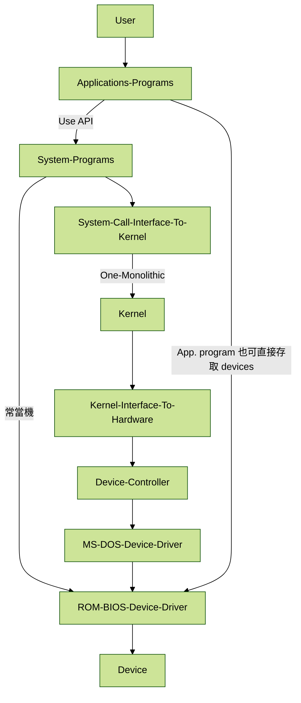
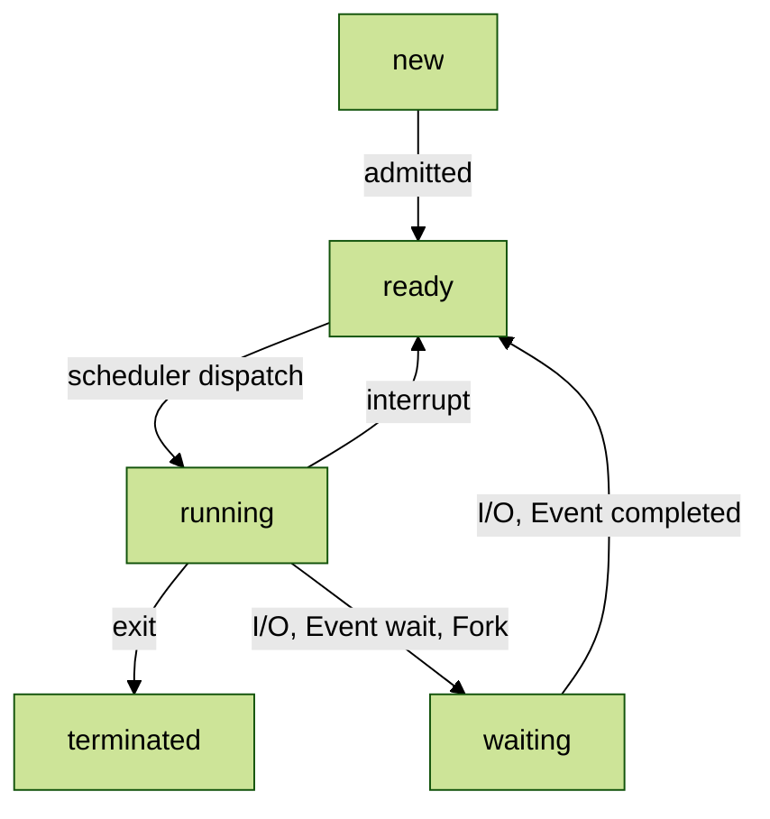
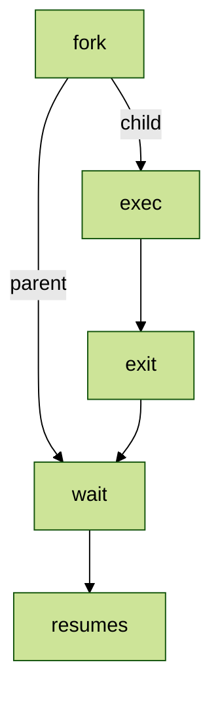
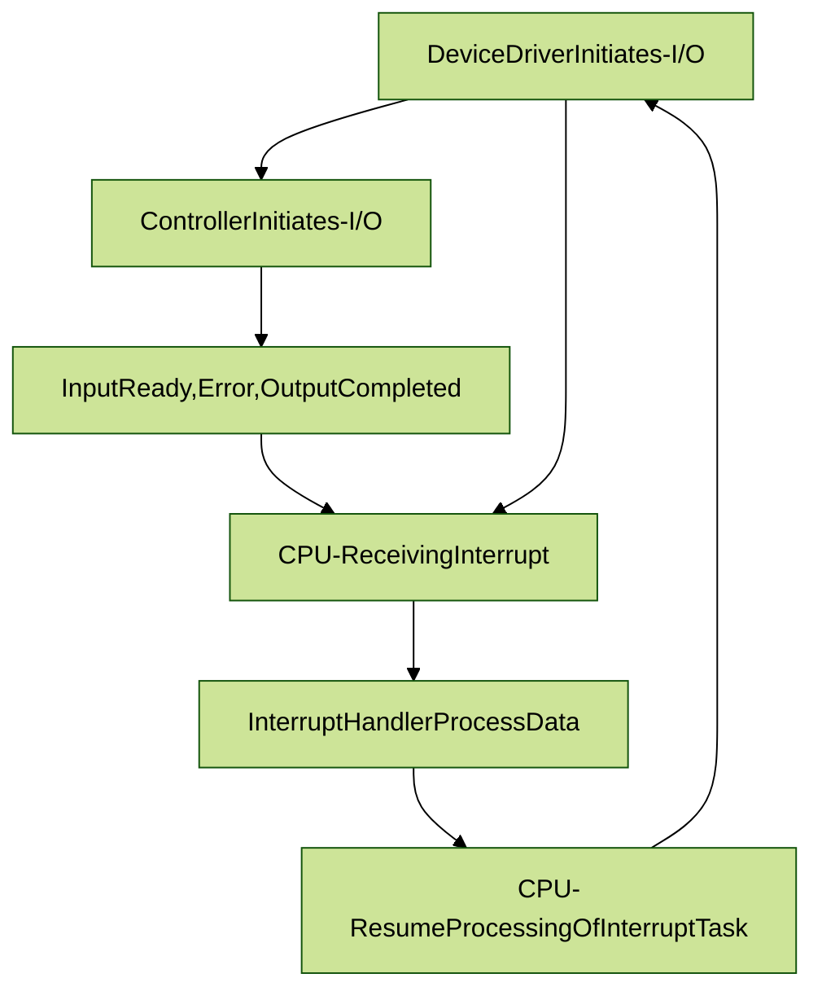
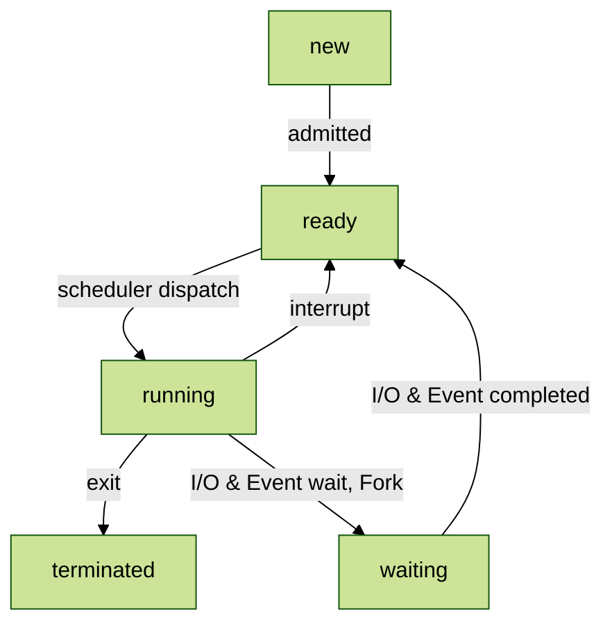

# 110-2 NTU-IM Operating System

**Author:**
* [ALu](https://github.com/ChiHaoLu)
* [KilliMilli](https://github.com/mollyy0514)

---

## Chapter 1

### Computer System

Computer system can be divided into 4 components:
1. User
    * Human, Other Computers, Machines
3. Applications Programs
    * Solve the computing problems of the users application
    * e.g. Compiler, Text Editor, DB, Games, Web Browser
4. Operating System
    * Control adn coordinates use of hardware
5. Hardware
    * Computing Resources: CPU, Memory, I/O Devices


Operating System
* Resource Allocator
    * 「解決」衝突請求
    * 公平地分配資源
* Control Program
    * 避免錯誤
    * 增進使用者的使用效率


Kernel: 一個在電腦中永遠都在運作的 Program

#### Device Controller
Hardware 與 Memory 運作的流程：透過 Device Controller
1. Hardware
    * Disks, 鍵鼠, 影印機, 螢幕
3. CPU & Device Controller: 不同的 controller 透過共用的 bus(提供存取 Shared Memory) 來連接到 Memory
    * Disks Controller, USB COntroller, Graphics Adapter
5. Memory

不同的 Device Controller 都擁有 Local Buffer 並且特別用途的 Register(暫存器)，可以用來短暫處理對接事務。

CPU 可以：
1. 從 main memory 移動資料到 local buffers
2. 從 local buffers 移動資料到 main memory 
3. I/O Devices 和 CPU 可以同時地運作

#### Bootstrap Program

當電腦開機或重起的時候 bootstrap program(引導程序) 會初始化並且載入到 OS-Kernel，通常 bootstrap program 會存在 ROM(唯讀記憶體) 中，或稱作 Firmware(韌體)。

Firmware(韌體)：內嵌在硬體中的軟體，可被電子設備執行

### Interrupt(Event)

Handshaking(交握)程序，也就是在資訊交換前對操作模式達成協定：

Busy-Waiting / Polling(輪詢) 是一個無限迴圈，會週期性地檢查需要服務的裝置，controller 會對 device 進行 I/O，host 會重複地讀取 `busy bit(in the device)` 直到 `bit` 被完成(clear)。最後 host 會讀取 device controller 中的 data，之後 I/O 才算完成。 

Interrupt 可以被硬體(I/O operations)或軟體(system calls)觸發。是一個硬體中的機制，可以提醒 CPU device I/O 已經完成了，並且 service 已經 ready。(非同步 I/O)

#### IRQ & Generic Routine

IRQ(Interrupt Request Line) 為中斷請求線，是硬體中的排線，是傳達給中斷訊息給 CPU 的實際硬體線。

當 CPU 偵測到 controller 傳出訊息， CPU 會存取 state(狀態)，並且將控制權(controller) 給 generic routine。

Generic Routine 會檢查 interrupt information 並且呼叫 interrupt-specific handler(中斷處理器)。

#### Interrupt Mechanism

現代的 Interrupt mechanism 會收到一個 address(index)，OS 會根據這個 interrupt ID 去查 Interrupt Vector(mapping table)，再根據其中存取的 Description 來決定要執行什麼動作。

如此就可以非常迅速地藉由 O(1) 的速度找到需要執行的動作，往常都是透過迴圈遍歷一個一個找，會耗費非常多的時間。

Interrupt Mechanism 同樣也會存取 interrupted instruction 的 `address` 和 `state`(processor register values)。

### Storage Structure

Main Memory 和 Registers 是唯一 CPU 可以直接地存取的容器。

* Register：建置在 CPU 內，CPU 會解碼指令並且在 registers 中執行簡單的 operations，像是要載入一個較大型的 program 需要先執行一個小的 program，而這個小的 program 便是這裡指的 operation。
* Main Memory：Computer Programs 必須要在 Main Memory 中才能被執行。

#### Execution Cycle

指令週期為 CPU 要執行一個機器指令的步驟：
1. 首先會從 memory 取得指令
2. 指令會存取到 **instruction register(指令暫存器, IR)**
3. CPU 會 Decodes，將指令解碼譯成機器語言
4. 執行
5. 儲存結果

#### Storage

我們沒辦法將所有的 Data 和 Programs 都存在 Main Memory，因為 Main Memory 太過狹小，也是**揮發性**記憶體(RAM)，所以只要關機就會釋放所有記憶體內容。

於是我們會使用 **Secondary Storage**，是 Main Memory 的擴充非揮發性記憶體容器，最常見的是 Magnetic Disck(磁碟)

還會有其他的儲存單位，像是 CD-ROM 或 Tapes。Storage System 會根據速度和成本有 hierarchy(等級制度)。

### I/O Structure


很大一部分的 OS Program 是用來管理 I/O。泛用型電腦中通常會多個 CPUs 和不同的 Device Controllers(各自對應不同用途和硬體裝置)，他們都連接到同一個 bus。

#### Device Controller 
在硬體和 Memory 之中具有 Device Controller，其包含 **local buffer storage** 和一組 **registers**，

而在 OS 中具有 Device Driver(驅動程式)，其是一對一地對應到 Device Controller，作為一個 uniform interface 的通用接口和 controller 對接。

* Software:
    * Kernel
    * Kernel I/O Subsystem
    * Device Driver(多個)
* Hardware:
    * Device Controller(多個，包含 registers & local buffers)
    * Device(多個，硬體)

#### I/O Operation

1. 初始化，載入暫存器：device driver 會對應 device controller 載入適合的 registers(暫存器)
2. 檢查命令：device controller 檢查 driver 中 registers 的內容，並且決定要執行什麼動作
3. 傳輸資料：controller 會開始從 device 傳輸資料到 local buffer(在 controller 中)
4. 告知完成：controller 會透過 **interrupt** 告知 driver 傳遞完成了
5. 交回控制權：driver 會將 control(控制權) 交還給 OS。


#### Device Drivers

驅動程式會在不同版本的 Device 中，執行不同版本或特性的內容，但對外提供相同的標準介面給 Kernel。

如此的優點是模組化和新(不同版本或不同型號的)裝置可以不用等 OS 更新就能夠使用。

### Computer System Arch.

#### Single-Processor Systems

**只有一個 CPU 可以執行 processor**，幾乎所有系統都有其他的 special-purpose proccessors，像是 Device-Specific Processors(e.g. graphic controllers)。

#### Multiprocessor Systems
又稱為 parallel systems(平行系統)，同時具有**多個 processors**，有規模經濟、高效率運行、增加穩定度，等好處。

有分為對稱(Symmetric Multiprocessing, SMP) 和非對稱(Asymmetric Multiprocessing, ASMP)。
* ASMP 中有一個主 processor 會去控制其他系統(slave processors)
* SMP 中每個處理器平等，都連到一個共享的主記憶體(Main Memory)，幾乎大部分現代 OS 都是 SMP

#### Core / Chip

在成本與速度方面：單晶片多核 > 多晶片單核

### Operating System Arch.

#### Multi-Programming

Multiprogramming 的能力是一個衡量 OS 能力最重要的指標。使用者沒辦法強迫 CPU 和 I/O 裝置一直運作，因為如果 I/O 一直 interrupt 的話 CPU 會被閒置下來。

所以需要 multiprogramming 來**管理各種不同的 jobs**
也就是說當當前工作需要 `wait` 的時候，OS 會改運作其他的 job，來讓 CPU 不停止地運作。

#### Time-Sharing(Multitasking)

是 Multiprogramming 的 Logical **Extension**，CPU 會高頻地 switches jobs，只要經過一定時間或需要等待就會馬上換別人。由於高頻率的特性，所以分時系統常常用在可互動的電腦系統，例如 interactive computer system(使用鍵鼠)。

Time Sharing 會限定每個工作的最大運行時間，使得不同 jobs 可以快速切換，能夠最小化 Response Time。而 Multi-Programming 可以最大化 CPU 使用率。

#### Process / Jobs

Time Sharing 和 Multiprogramming 都需要不同的 jobs 同時儲存在 memory 中。**其中一個 program 被載入到 memory 中並執行這個動作稱作 process。**

如同前面幾個小節說的，Main Memory 太小了所以沒辦法儲存所有的 jobs，所以在 **disk** 中會有一個儲存全部 jobs 的容器稱作 **job pool**。在其之中的 jobs 會一直等待被分配到 main memory。

而抓取 jobs 從 jobs pool 中被載入到 memory 中執行的人就是 Job Scheduler(Chapter 5)。

如果有多個 jobs 都已經 `ready`，則 CPU Scheduling 會選擇誰可以被載入 memory 執行。

#### Process Management

Process(主動) 唯一個正在運作的 Program(被動)，

* Single-threaded process：只有一個 program counter
* Multi-threaded process：在每一個 thread 中都有一個 program counter

Program Counter 中會存**下一個要執行的命令的位置**

通常 User、OS 可以同時地在 CPU(s) 中運作

### Dual-Mode Operation

Program 依據執行內容可以分成 operating-system code 和 user-defined code，因為 CPU 的運算資源只能被 OS Code 執行以避免被 user-defined code 破壞，所以出現了 dual mode。

例如讀寫檔案的過程，必須要通過 OS 的核准才可以進入 kernal mode 來進行編輯。

Dual Mode 分成：
* User Mode(mode bit = 1): 
    * 執行 user process
    * 在需要 OS Service 的時候呼叫 System Calls
* Kernal Mode(mode bit = 0):
    * 當 OS 接收到 System Calls 後轉為 Kernal Mode
    * 執行 System Call
    * 將控制權還給 User Program

會將控制權轉給 OS, Kernal Mode 的情況：
1. Interrupt：管理運算資源
2. Trap：避免錯誤
3. System Call：需要 OS Services

### Caching

因為資料在 storage system 中不斷地進出非常耗費時間成本，所以在 storage system 中有一個 Cache(緩存、快取)，可以在我們需要特定資訊的時後先被查看，如果裡面已經有我們要的資料(過去複製進來過了)，那我們就可以快速的使用他們。

然而 Cache 是昂貴且容量很小的，所以需要 Cache Management。

---

## Chapter 2

### Operating Service

1. User Interface
    * Command-Line Interface(CLI): 
        * 辨識 -> 載入記憶體 -> 執行
        * System Program 有可能在 kernel 執行
        * OS 擁有 multiple interpreter to choose from, **shells**
    * Graphics User Interface(GUI)
    * Batch
2. Program Execution
3. I/O Operation
4. File-System
5. Communications(shared memory)
6. Error Detection(軟硬體都偵測)
7. Resource Allocation
8. Accounting
9. Protection and Security

### System Calls

System calls 是一個 Operating System 提供的 programming interface，可以用來使用 System Service。

通常 Programs 透過高階程式語言的 API 來存取 system services。例如 standard C library 之類的。

使用 API 而不是直接呼叫 System call 的原因：
1. 模組化，跨版本或跨平台的適配度。
2. 較好使用

通常 API function 和 System Call 是 1-1 Mapping 的。

#### Parameter Passing

User Program 傳遞 parematers 到 OS 的三個方法：
1. 直接把資料傳遞給 registers：最簡單，但參數長度有限制
2. Stored in Block in memory，block 的 address 會被當作 parameter 傳遞給 register
3. Parameter 會被 push 進 stack，並被 OS 從 stack pop off


#### Types of System Calls

1. Process Control
    * halt execution, load program, wait for created processes
    * Single Tasking System: command interpreter 可以吧 program 載入 memory
    * Multitasking System: 有多個 process 在運作，此時的 interpreter 就是一個 shell 在 running。當我們要創建一個新的 process 就要讓 shell 來執行一個 `fork()` system call
3. File Management
5. Device Management
6. Information Maintenance
7. Communications
    * Message-passing Model: 
        * 一個 client 端呼叫資料，server 端才給資料 
        * -> 簡單
    * Shared-memory Model: 
        * 有一個共用記憶體部分，誰想要資料就使用 system call 去裡面取(讀寫) 
        * -> 快速

#### System Programs

User 只認識 system call interface 中的 system program，並不是真的呼叫 system call，就如同前我們我使用高階語言中的 API 的情況一模一樣

* File Manipulation
    * 刪、複製、增、印、看
* File Modification
    * Texty Editors
* Programming Language Support
    * Compilers, debuggers, interpreters
* Progran loading & Execution
    * Loader
* Communications
    * the mechanism of connections of processes, user and computer systems


### Operating System Structure


#### Normal



System Programs:
1. **Shell** and commands line
2. **compilers and interpreters**
3. system libraies

Kernel
1. file system
2. **CPU Scheduling**
3. signals terminal -> **Handle I/O System**

#### Layered Approach

將 OS 切成更多層並且進行模組化，透過 interface 來穿透每層。

* Bottom Layer 是 layer-0：靠近硬體
* Highest Layer 是 layer-N：靠近 user interface

第 M 層可以：
* call 0 ~ M-1 層: Low Level Call
* 被 M+1 ~ N 層 call: High Level Call

易於 Debug 而且可以避免底層直接被傷害到，但是 SYSTEM SERVICE 通常都會糾結在一起，不容易一一分層。


#### Micro Kernels

client program 和 service 是非直接地溝通，會在不同的 micro kernels 中互換運作，傳遞資料

優點：如果有新的 OS 服務，我們只要對一個 microkernel 更新就好
缺點：分界有時候很模糊

#### Modular Kernel

建造非常多的 modular kernel，他們都是一個一個的 classes，會各司其職，其中還會有一個 core kernel 來利用 interface 操作各個 kernel module(system service)。


### OS gerneration

簡單來說就是怎麼在電腦裡面灌作業系統。通常是使用 disk 或者 CD。

需要定義的東西有 CPU(如何定義浮點數)、Devices(interrupt 運作方式)、Memory(Size 多大)、OS Options(CPU scheduling)。

每次在使用 OS 的 system service(system code) 時有兩種方法：
1. 每次都重新編譯，比較慢，但是 more specific
2. 從已經編譯的 library 中找 modules 來用，因為不用重新編譯所以比較快，但是會比較消耗資源。

### System Boots

Booting：啟動電腦的時候需要執行的程序，利用 bootstrap program(引導程序)。

Bootstrap program(引導程序)：
1. 從 disk load 到 memory
2. 有一個 simple code 存在 ROM 裡面(非揮發性的，會依值都在)
3. 用這個 simple code 來初始化作業系統需要的各個東西

兩階段的 Bootstrap program(引導程序)：
1. 用一個簡單的 bootstrap 來取得更多複雜的 bootstrap
2. 將他們載入 kernel 後執行

這些 boot program 儲存在 boot block(在硬碟裡面) 之中，等這些 boot program 都跑完成了 OS 才開始跑。  

---

## Chapter 3

### Process Concept
* Batch System: Jobs
* Time Shared Systems: User Programs or Tasks

Proccess 就是一個正在運作的 program(一段程式碼)

#### Process in Memory：
1. Text Section: Store **Code**
2. Data Section: **Global** Variable
3. Heap: **dynamic** memory allocation
4. Stack: **temp** data. e.g.local var.
5. Program counter: 下一個指令的 address
6. Register 的狀態

Program 是一個被動的個體，他們會條列地靜靜躺在 disk 裡面，而 process 是 program 從 disk 被載入(load) 到 memory 之後的運作狀態。

程式碼一模一樣代表 program 一樣，但不代表 process 一樣，因為該 process 的記憶體(heap, stack, data section...) 可能不同。

#### Process State



#### Process Control Block(PCB)

PCB 代表 process 在 OS 裡面的存在，會存取一些資訊：
1. Process state
2. Program counter(下一個指令的 address)
3. CPU Registers
4. CPU Scheduling information(Process Priority)
5. Memory management information
6. Accounting information
7. I/O Status

上述說的同一個 program(code) 會產生不同的 process 的原因就是 Process 裡面會有不同的 PCB information。

### Process Scheduling

* Multiprogramming: 很多個 process 同時運作
* Time-Sharing: 只有一個 process 可以運作，CPU 會非常快速地切換各個 process

Process Schedular：在 ready state 裡面挑一個來 run

OS 裡面通常會有很多個 **queues**，每一個 PCB(Process) 都會有一個 pointer 指到下一個 PCB(Process)。

Job Queue 代表這些 Job 的等待順序。
* Ready Queue：在 main memory 中，**ready state** 的 process 們的 queue
* Device Queue：在 waiting state 中正在等待的 I/O Device

Schedular
* Job Schedular 是一個 Long-Term Scheduler，Job Schedular 會從 memory 裡面挑一個進來 ready state 排隊。
* CPU Schedular 是一個 Short-Term Scheduler，會從 ready state 裡面挑誰是下一個執行(run) 的 process。運作頻率較高。

Process 根據其目的，通常也可有相對應的別稱：
* I/O Bound Process
* CPU Bound Process

### Context Switch

這裡的 Context 指的是 Process 之中的 PCB。

當前的 CPU 在運作哪個 process 就要去 Load 他的 PCB，所以執行到一半的 Process 他的 PCB 也就是他的 State。

當遇見 Interrupt 時就會先存取原先執行的 Process(PCB_0) 中的 State，然後載入新的 Process(PCB_1) 的 State。

### Operations On Processes

一個 process 可以創造另外一個 process，創造者為 parent，被創造者為 child。透過 `pid_t pid = fork()` 來創造。 

每一個 process 都會有一個識別碼(`int`)：也就是 `pid`
* `pid > 0`: parent
* `pid == 0`: child process
* `pid < 0`: error

當我們在 parent process 中加入 wait(NULL) 就可以確保在 child process 執行之前，即便 parent 先搶到 CPU 也不會繼續執行下去。



### Interprocess Communication

* Process Independent: 無法影響其他 process 的執行
* Process Cooperating: 可以影響其他的 process
    * 模組化、方便、分享資料、加速

Interprocess Communication(IPC) 是一個不同的 processes 合作的機制，標明了他們的是如何交換資訊的。

IPC Models
* Shared Memory: 藉由共用記憶體直接取，快
* Message Passing: 直接傳資訊給對方，慢，因為要透過 system call 不斷傳進傳出

### Shared Memory Systems

Shared Memory 有 Producer-consumer problem

Buffer 就是 Shared Memory，會被 Producer process 放入資訊，被 consumer process 取出使用。

* unbounded buffer: producer 可以一直 produce 
* bounded buffer: producer 在 buffer 滿的時候就不能產了

#### Shared memory example

* `segment_fd = shm_open(naem, O_CREAT | O_RDWR, 0666)`：創造 shared memory
* `ftruncate(shm_fd, 4096)`：指定 memory size
* `ptr = mmap(0, SIZE, PROT_WRITE, MAP_SHARED, shm_fd, 0)`：接起來
* 確認 shared memory 沒人要用了的時候就會呼叫 `shm_unlink()`

### Message-Passing Systems

* Direct-symmetry-communication：需要註明「接收者(sender)」和「傳遞者(recipient)」，資訊只能在其之中一對一對傳遞
* Direct-asymmetry-communication：只需要註明「傳遞者」，所以 sender 要把 message 給誰都可以

在 sender 和 recipient 進行 `send` 和 `receive` 之中有不同的設計模式：
* Blocking(synchronous) send：sending process 會被 blocked 直到這個 message 被接收者接到為止
* Non-Blocking(asynchronous) send
* Blocking Receive：只收可收的
* Non-Blocking Receive：什麼都收

#### Buffering

資訊傳遞的時候需要將資料暫存在 temporary queue 裡面，也就是 buffering，這樣的暫存機制也決定了 sender 會不會被 block
當 Buffer 是：
* Zero Capacity：因為沒辦法暫存，所以 sender 只要在 recipient 還沒接收到訊息之前都會被 blocked
* Bounded Capacity：有一定的長度，只要滿了 sender 就會被 blocked 直到 recipient 接收到訊息
* Unbounded Capacity：sender 永遠不會被 blocked

---

## Chapter 4

### Overview

Multithread process
* 有多個 register + stack + thread 來運作多個 process

Single-Thread process
* 只有一個 register + stack + thread 來運作一個 process

### Multithread

User Thread: 不需要被 kernel 管理
Kernel Thread: 直接被 OS 管理

#### Many-to-One Model
多個 user level thread 對應單個 kernel thread，有效率但是只要一個 thread 被 block 全部的 process 就會被 block。因為 system call 只能被單一個 kernel thread 執行。

因此不允許 multiprocessors 的平行運作。

Thread Management 會在 User Space 被完成

#### One-to-One Model

允許 multiprocessors 的平行運作。因為 kernel 是一對一的，所以可以透過「多個」thread 平行地和相對應的 kernel 進行互動。

Thread Management 會在 Kernel Space 被完成

### Pthreads

Pthread 定義了一個 thread 的介面，也就是只定義了函式的名稱和型態，但是並沒有內部的實作部分。

* `pthread_t tid;`
* `pthread_attr_t attr;`
* `pthread_attr_init(&attr)`: 初始化
* `pthread_create(&tid, &attr, runner, argv[1])`：創建新的 thread
* `pthread_join(tid, NULL)`：等待 child thread 被執行完成

在 child thread 執行的程式碼為 `runner` 函式：
其中 `pthread_exit(0)` 會中止這個 thread 的運作。

### Scheduler Activations

upcall 是 kernel 與 user thread(application) 溝通的方式。藉由 thread library 中提供的 upcall handler。

在當前的 kernel 在 blocking 之前，會先用來 new 一個 kernel 來讓 upcall handler 紀錄當前運作到一半的 state。在記錄完之後 kernel 就會被 blocking。

在相關行為完成之後 upcall handler 會啟動 scheduler，使其重新在 ready 裡面挑選新的 thread 執行。

We need a scheduler to be activated by kernel before the thread blocked.


---

## 2014 MID

### 1. Hardware Devices, Interrupt
#### a.
interrupt-based 比 busy-waiting 好的優點是，演算法效率較好，因為 interrupt-based 會等 interrupt 出現才去看需要的指令是何者。而 busy-waiting 會遍歷所有的指令，來查看符合當前命令的是何者，最後才執行。


#### b.

當 CPU 偵測到 device controller 傳出訊息(IRQ 的中斷訊息排線被拉動)，就會將 state saving，並且把控制權交給 generic routine。之後 generic routine 會呼叫 interrupt-specific handler。

其中 CPU 會透過 interrupt vector 來查詢進行 I/O Interruption 的指令實作。

#### c.

interrupt-based 會使用 address 來查詢 interrupt vector，以類似 map(hash-table) 的方式來取得指令實際要實作的行為是什麼。

### 2. ASMP vs. SMP

* ASMP 中有一個主 processor 會去控制其他系統(slave processors)
* SMP 中每個處理器平等，都連到一個共享的主記憶體(Main Memory)，幾乎大部分現代 OS 都是 SMP

### 3. OS Support New Devices

有一個一樣的 device controller 對接硬體中的 device driver(驅動程式)，其中 driver 會給予一個一致性的對外介面，內部會根據不同型號或版本的硬體做改變。以此達到與 OS 互動上的模組化。

### 4. System Calls

#### a.

當 user 呼叫了 API function 後，API 會觸發 system call 並且會發出 software interrupt，來把 mode bit 從 1 轉為 0 以此進入 kernel mode。

接著 kernel 會透過查看 interrupt vector 來檢驗這個 system call 需要的 service 是何者。每個 system 都具有不同的 table of code pointer，藉由 system call number，我們可以跳到 interrupt vecotr 中相應的 address。

完成了之後會將控制權交還給 user(mode code 由 0 轉為 1)。

#### b.

因為直接呼叫 API 可以確保程式碼模組化，當 API 的實作內容因為各種版本改變或作業系統更改後，工程師可以不用再去更改當初呼叫 API 程式碼部分的函式名稱或參數等。

#### c.

1. Pass the parameters in registers(暫存器)
2. Stored in the Block(記憶體區塊)
3. Push the parameter to the stack，and Pop when OS need it

### 5. The 4 Components of Process in Memory

1. Text Section: Store Code
2. Data Section: Global Variable
3. Heap: dynamic memory allocation
4. Stack: temp data. e.g.local var.

### 6. Multithread Models

#### a.

many-to-many thread model may happen that available kernels become less, and program will be less efficient.

So we need a scheduler to be activated by kernel before the thread blocked.

#### b.

upcall 是 kernel 與 user thread(application) 溝通的方式。藉由 thread library 中提供的 upcall handler。

在當前的 kernel 在 blocking 之前，會先用來 new 一個 kernel 來讓 upcall handler 紀錄當前運作到一半的 state。在記錄完之後 kernel 就會被 blocking。

在相關行為完成之後 upcall handler 會啟動 scheduler，使其重新在 ready 裡面挑選新的 thread 執行。

### 7. Preemptive vs. Non-Preemptive

Preemtive Scheduling Algorithms
1. From Running to Waiting: I/O, Fork
2. From Runnint to Ready: interrupted
3. From Waiting to Ready: Completion of I/O
4. Terminates

Non-Preemptive Scheduling Algorithms
1. From Running to Waiting: I/O, Fork
2. Terminates

在 non-preemptive 的情況以下，process 會持續占用 CPU 直到整個 thread 都完成，或被 switching 到 waiting state。

### 9.

```c=
/*------------------------------------- Reference -------------------------------------*/
//  OS-110 HW-1 3.15
//  Author: b08303113 ChiHaoLu
// 	Reference: 
//  	https://man7.org/linux/man-pages/man3/shm_open.3.html
//	https://www.geeksforgeeks.org/posix-shared-memory-api/
//  2022/3/20
/*-------------------------------------------------------------------------------------*/

#include <stdio.h>
#include <stdlib.h>
#include <string.h>
#include <sys/types.h>
#include <sys/mman.h>
#include <sys/stat.h>       		/* For mode constants */
#include <unistd.h>			/*For ftruncate*/
#include <wait.h>
#include <fcntl.h> 			/* For O_* constants */ 
#define true 1
#define false 0

/*
a. Establish the shared-memory object (shm open(), ftruncate(), and mmap()).	--> Build a shared-memory
b. Create the child process and wait for it to terminate. 						--> Construct a child-process with the Collatz Conjecture Concerns 
c. Output the contents of shared memory.
d. Remove the shared-memory object.

Shared-Memory
1. Sign-Up the "shm_fd" with the "shm_open"
2. Get the pointer of shared_memory by "mmap()"
3. R/W the Data with the pointer
4. Unravel the relationsjip between the process and shared_memory with "shm_unlink"
*/


int main(int argc, char *argv[]) {
	
	// 3.15 input =25
	int input = 0;
	printf("Input: ");
	scanf("%d", &input);
	printf("\n");
	
    	const int SIZE = 4096; 									/* the size (in bytes) of shared memory object */
    	const char* name = "OS_Shared_Memory_Collatz"; 								/* name of the shared memory object */
    
	/* 
	shm_fd: shared memory file descriptor
	create the shared memory object
	From the <fcntl.h>*/
	int shm_fd = shm_open(name, O_CREAT | O_RDWR, 0666); 		
    
	/* 
	ftruncate:
	truncate the size of the shared memory object to length = SIZE
	From the SIZE = 4096 and <unistd.h> */
	ftruncate(shm_fd, SIZE);		
	
	/* pointer to shared memory object
	& use "mmap" to memory map the shared memory object (actual memory store)*/
    void* ptr = mmap(0, SIZE, PROT_WRITE, MAP_SHARED, shm_fd, 0);
	
	/*
	Sign up a child process
	*/
	pid_t pid;
	pid = fork();
	/*  after "fork()", the process will return the "PID"
	PID < 0: process failed
	PID == 0: child process now
	PID > 0: parent process now
	*/

	if(pid > 0){ // parent
		// wait for the child process completed
		printf("Child Process Underway...\n");
		wait(NULL);
		printf("Child Process Completed Successfully\n");
		/*
		Read only, "O_RDONLY" -> parent process "only read" the share_memory.
		*/		
        shm_fd = shm_open(name, O_RDONLY, 0666);	
        ptr = mmap(0, SIZE, PROT_READ, MAP_SHARED, shm_fd, 0);
        printf("Parent is reading the shared memory...\n");
        printf("%s",(char *)ptr);
        shm_unlink(name);
	} 
	else if(!pid) { // child
        shm_fd = shm_open(name, O_CREAT | O_RDWR, 0666);
        ftruncate(shm_fd, SIZE);
        ptr = mmap(0, SIZE, PROT_WRITE, MAP_SHARED, shm_fd, 0);

        printf("Child Process Beginning:\n");
		while(input != 1){
			
			if(!(input % 2)){
				input /= 2;
			}
			else {
				input = 3 * input + 1;
			}
			sprintf(ptr, "%d, ", input);
			printf("%d ", input);
			ptr += strlen(ptr);
			
			if(input == 1){
				printf("\n");
			}
		}
	} 
	else {
		/*
		If failed, 
		output a error message to "stderr" and unravel the relationship between memory-share and process
		*/
		printf("Invalid Input, the Input must greater than 0.");
		fprintf(stderr,"Fork Failed\n");
    	shm_unlink(name);
		return 1;		
	} 	
	
	return 0;
}
```

---

## 2015 MID

### 1. Device Controller & CPU Route



### 2.High Level Languages Advantages

Easy to Debug, Easy to read 

### 3. Command Interpreter

比較不常被呼叫的指令應該被存在 disk 裡面，常被呼叫的應該要存在 command interpreter，存在 command interpreter 雖然比較快但是比較耗資源而且比較貴。反之存在 disk 裡面會比較便宜但是指令不斷出入會很耗時間。

### 5. State

1. After it is created by a parent process: Ready
2. Before selected by a short-term schedular: Ready
3. After selected by a short-term schedular: Run
4. After it invokes a blocking system call: Waiting
5. After blocking system call is completed: Ready
6. After interrupted by a hardware interrupt: Ready
7. After its time slice expired: Ready 

### 6. Multithreaded Programming

#### a.

不同的 process 有他們自己的 stack, heap 等記憶體容器，因此開多個 process 會耗掉大量的記憶體。但打開不同的 threads 他們是共用記憶體的，因此比較不會消耗那麼多。

#### b.

* Many-to-one Model: one kernel thread --- many user threads
    * 優點：efficient，因為沒有 kernel intervention
    * 缺點：只要一個 user thread 被 blocked，那全部的 user threads 就會被 blocked
    * Thread management is done in user space
* One-to-one Model: one kernel thread --- one user thread
    * 讓多個 threads 平行地跑在單一一個 multiprocessors 中
    * 優點：當有一個 thread 被 blocking system call，其他 threads 還是可以跑
    * 缺點：負擔較大，限制較多
    * Thread management is done in kernel space

### 7. Priority Scheduling Algorithms

priority scheduling algorithms 中有可能因為不同的 priority 導致低優先度的 process 永遠不會被執行到。因此我們要加上一個 `age` 來讓等得越久的 process 有一個加權的分數加到優先度上，等到一定時間之後原先低優先度的 process 也有機會被執行到。


---

## 2016 MID

### 2.

#### c. Pros and Cons of layered operating system structure

* 優點：
    * 易於 debug
    * 可以保護 hardware 直接地被傷害。
* 缺點：
    * 不同的 service 可能環環相扣很難分層，
    * 分層之後在層層之間傳遞 system call 可能會比原先耗掉更多時間

### 3. Process State

#### a. 


#### b.

果我們拿掉 `wait()` 將會導致我們無法確保 child function 比 parent 早執行，沒辦法確保誰會拿到 CPU，因此 output 沒辦法預測


---


## Chapter 6 - Synchronization

[OS - Ch6 同步問題 Synchronization](https://mropengate.blogspot.com/2015/01/operating-system-ch6-synchronization.html)

### Background

#### Cooperating process

該 Process 能夠影響其它 Process，或是受其它 Process 影響，故 Process 之間會有共享的資料（shared data），需要有進行資訊交換的管道。
> 合作就是有 shared data，可能有結果不同步


因為有可能同時有兩個 Process 都 access to shared data，導致 **data inconsistency**（要 cooperating 搭配 preemptive 才會發生），因此需要 mechanisms 來限制一次只能處理一個 process。

#### Producer-consumer problem

- Producer process: 在 shared, bounded buffer 上產生新東西。**（write）**
    - 給 data
- Consumer process: 去同一個 buffer 把資料取出來。**（read）**
    - 拿 data


> Producer 和 Consumer 同時運作可能有問題

#### Race condition


- 同時間有不只一個 Process 取得 access，並 manipulate the same data concurrently。
- 結果就會跟取得 access 的順序有關。

例如 producer 先取得 access，並改了 shared data，但是值還沒有回傳就被 preempted，consumer 就會讀到舊的 data，因此結果就不一定是正確的。

> 希望可以確保 update shared data 這個動作不可斷

### Critical-Section Problem

[作業系統 Critical section](https://ithelp.ithome.com.tw/articles/10252349)

#### Critical section

> critical section 指任何有關 race condition 的情境
> 是 process 中的一段程式碼

一段會改到 shared variables、updating a table、writing a file 等的程式碼。

每一個 system 都有 n 個 process，而每個 process 都有一個 critical section。

如果我們要在其中一個 process 正在執行 critical section 時，其他 process 就不能執行，we need to design a protocol！

#### Solution Requirements

> Protocol
> * entry section: 擋住其他人
> * critical section
> * exit section：釋出結束訊息

結構：
- 每一個 Process 都要 request permission 才能進入 critical section -> **entry section**
- updae shared data -> **critical section**
- crtical section 執行完畢接著的 -> **exit section**
- 與 update shared data 無關的 code -> **remainder section**

條件：
- **Mutual exclusion**: 已經在跑的時候要擋住其他人
一次只能一個 Process 執行 critical section，而這可以利用 Protocol 達成。
- **Progress**
（不可以 always block，一定要挑一個 process 進來。）
不想進入 critical section（正在執行 remainder section）的 process 不可以阻礙其它 process 進入 critical section，即不可參與進入 critical section 的決策過程。且不可以 postponed indefinitely。
- **Bounded waiting**: 必須保證一個等待的限度
保證最多等 n-1 輪，以避免 starvation。


#### Implementing

- nonpreemptive kernels: 沒辦法切就可以做滿
因為不容許preempt，因此一定會 free from race condotions on kernel data structures。不過一般而言不會用 nonpreemptive，因為萬一遇到 infinite loop 就死了。
- preemptive kernels:
當一個 process 正在 kernel mode 跑的時候，allow a process to preempt。必須注意的是，在設計 kernel 的時候要確保 kernel data are free from race conditions。

### Peterson's Solution

A **software-based** solution to the critical section.

因為限制只能 2 個 Processes，所以不太實用。

需要額外兩個 shared data 代表換誰:
``` c
int turn;    // 表示現在是 whose turn to enter critical section
bool flag[2];    // 表示這個 process 是否已經 ready to enter critical section --> 想不想要進
```

``` c
do {
    /* entry section */
    flag[i] = true;
    turn = j;    // 是把 turn 給對手！
    while (flag[j] && turn == j);    // 用無窮迴圈來擋
    
    /* critical section */
    
    /* exit section */
    flag[i] = false;
    
    /* remainder section */
}
```

> * process i 和 j 可能做不同事情
> * Critical Srction --> Update Shared Data

#### 證明自己

1. **Mutual exclution is preserved.**
    - a process enters its critical section only if `flag[j] == false` or `turn == i`
    - 如果兩個 processes 都想要 enter，則 `flag[i] == flag[j] == true`
    - 但是！turn 只能是 0 或 1！ --> 保證只有一個人進
    - 所以另一個 process 只能等到這個 process 的 critical section 跑完之後才能進來。
2. **The progress requirement is satisfied.**
    - Case 1: 如果 `Pi` 要進入 critical section 了，而 `Pj` 還在 remainder section，這時候 `flag[j] == false`，因此 `Pi` 可以進入 critical section。
    - Case 2: 如果 `Pi`、`Pj` 都已經(想)要進入 critical section， `flag[i] == flag[j] == true`，此時如果 `turn == i` ，就是 `Pi` 進去 critical section，如果 `turn == j`，則是 `Pj` 進去跑。
3. **The bounded-waiting requirement is met.**
    - process 是不能一跑完 critical section，馬上又去搶 CPU 的，以避免 starvation。因此當 `Pj` 離開 critical section 並將 `flag[j]` 設成 `false` 時，如果馬上又將 `flag[j]` 設成 `true`，則 `turn` 也會被改成 `i`，因此就會進 while loop。

### Synchronization Hardware

任何一個 critical-section problem 的解法都需要**lock**。

- **atomic**：不可以被打斷的（uninterruptible）

``` c
do {
    acquire lock
    
    /* critical section */
    
    release lock
    
    /* remainder section */
} while (TRUE);
```

1. uniprocessors：**disable interrupts**
現在正在跑的 critical section 用 lock 給鎖住，使其不會被 preempt，但這是一個非常不好的方法，沒有效率，所以需要用到atomic方法。
2. modern：**atomic hardware instructions**
++Test and modify++ the content of a word 與 ++Swap++ the contents of two words 都是 atomically。

#### atomic `TestAndSet()`：

用來換鎖

``` c
bool TestAndSet(bool *target) {
    
    bool rv = *target; // 舊的值先存起來
    *target = true; // 鎖起來(第一個人)
    
    return rv;    
    // 回傳舊的值，因此如果原本的 lock 就是 true 就不會跑別的（lock 並維持 true）
    // 如果是 false 就把鎖改成 true，
}
```

藉由宣告一個布林值`lock` 並初始化為 false 來實踐「mutual exclusion」，舊的 lock 還是 true 的話就不會跑別的。

> lock 是一個 boolean，default = false，代表開的
> 第二個人看見第一個人鎖的值(true)，開始在 while 鬼打牆

在 process P~i~ 中：
``` c
do {
    while (TestAndSet(&lock));    // 如果被鎖了（原本的 lock == true）就用 while loop 擋住
    // 如果原本 lock == false，就會接著執行 critical section
    
    /* critical section */
    
    lock = false;    // 沒被鎖，第一個人做完要釋放
    
    /* remainder section */
} while(true);
```

#### atomic `Swap()`

``` c
void Swap(bool *a, bool *b) {
    bool temp = *a;
    *a = *b;
    *b = temp;
}
```

一樣是宣告 `lock`，並初始化成 false。

在 process P~i~ 中：
``` c
do {
    key = true;
    while(key == true) {
        Swap(&lock, &key);
    }    // 換回來 key 是 false 就可以 enter in critical section
    
    /* critical section */
    
    lock = false;    // 如果沒有改成 false，key 怎麼換都會是 true，就會一直鎖住
} while(true);
```

大家會一起共用這把鎖
```
第一個人做：
- 第一人： lock(false) <-> key(true)
- 第二人： lock(true) <-> key(true)

第一個人做完：
- 第一人： lock(false)
- 第二人： lock(false) <-> key(true)
```

以上兩個演算法都只有滿足 mutual-exclusion，並沒有滿足 bounded-waiting，所以有可能會造成 starvation。

#### 改善方式

一樣也是用 `TestAndSet()`，不過這個方法多加了兩個 shared data，其初始值都是 false：
``` cpp
bool waiting[n];    // waiting[i] is true if Pi is waiting
bool lock;
```

在 process P~i~ 中：
``` c
do {
    waiting[i] = true;
    key = true;
    while (waiting[i] && key) {
        key = TestAndSet(&lock);
        // 如果 lock 是 true，key 不管怎麼換都會是 true，因此就一直在這個 while loop 裡
    }
    waiting[i] = false; // 成功進了
    // 必須 key 或 waiting[i] 是 false 才能進入 critical section
    
    /* critical section */
    
    // i 做完了不隨便丟鎖，一直往後點名
    j = (i + 1) % n;
    // j == i 代表已經點了一圈回到自己    
    // waiting[j] == true 就讓 j 進去跑
    while ((j != i) && !waiting[j]) {
        j = (j + 1) % n;
    }
    
    if (j == i) {    // 都沒有人要進來
        lock == false;
    }
    else {    // 如果有人要進來，是改 waiting，不是改 lock！（lock 仍然是 true）
        waiting[j] = false; // 抓人進來做
    }
} while (true);
```

依照這樣的設計，waiting process 最多會等 n-1 輪(i 的前一個人)，因此就滿足了 bounded-waiting。

### Semaphores

**software-based solution**（hardware-based solution 十分複雜）

- 簡化 critical section 的解決方法
- semaphore 是一個 integer
- 除了一開始 initialization，必須透過兩個 atomic operation 來更新資料：
    - `wait()`：
        ``` c
        wait(S) {
            while (S <= 0){};
            S--; // 其他人看到 0 會鬼打牆
        }
        ```
    - `signal()`：
        ``` c
        signal(S) {
            S++; // 做完改回 1
        }
        ```

#### usage

> Binary semaphore 是用來搶鎖或者解鎖的動作

- **Binary semaphore**（`mutex` locks）
    - `mutex` = 0 or 1，初始化為 1，processes 們會共用一個 mutex
    - 可以用來處理 multiple process 的 critical-section problem
    - 第一棒進入 `wait()`，`mutex-1 = 0`，這時候第二棒、第三棒、... 都進不去，直到第一棒執行完 crirical section，進入 `signal()`，`mutex+1 > 0`，第二棒才能繼續。
    ``` c
    do {
        wait(mutex);

        /* crirical section */

        signal(mutex);
    } while(true);
    ```

- **Counting semaphores**
    - `synch` 初始值不一定要是 0 or 1，沒有一定的範圍
    - semaphore 與資源數有關，會初始化成 available 的 resource 數量
    - 當 `synch` 變成 0，代表所有資源都被使用了，想要 request 一個 resource 的 process 就會被 block，直到 `synch` > 0。
    - 後執行的 process 一定要等 P~1~ 執行完 `signal(synch)` 才能開始執行 `wait(synch)` 接著執行 S~2~。（S~i~：statement in P~i~）

> 想要先跑的在後面插一個 signal()，想要後跑的在前面插一個 wait()

#### implementation

semaphore 的缺點就是他需要 **busy waiting**，又稱為 **spinlock**，因為 process 正在等待 lock 的時候會 spin。

一個正在 waiting 的 process 會一直在跑 loop，而這樣的情況既浪費時間又浪費 CPU 資源。

如何克服需要 busy waiting？
- in `wait()`
    - 當一個 process 發現 semaphore 的值非正數，以 block itself 來代替 busy waiting
    - block operation：把 process 加入一個 waiting queue（waiting queue 裡面每個 process 都是 waiting state）
    - 讓 CPU scheduler 去選接下來要做執行的 process
- in `signal()`
    - 當做 `signal()` 的時候，一次叫醒一個正在 waiting 的 process 來執行（wakeup operation -> To ready）
    - wakeup operation：把 process 從 waiting state 變成 ready state，並將這個 process 加入 ready queue
    - 至於 CPU 會不會執行最新加入 queue 的 process，還是要看 CPU-scheduling algorithm（通常是 FIFO）

> * 每個 semaphore 有自己的 queue
> * Block itself 這個動作來自善心人士寫的 API

不過以上並不是一個正統的做法，正統做法：

設一個叫 `semaphore` 的 struct：
``` c
typedef struct {
    int value;    // 絕對值代表有多少 process 正在排隊
    struct process *list; // PCB
} semaphore;
```

- in `wait()`：
``` c
wait(semaphore *S) {
    S->value--;
    if (S->value < 0) { // -1 代表一個人在排隊，-2 代表兩個人在排隊
        
        /* add this process to S->list */
        
        block();
    }
}
```
第一棒進入 `wait()`，`S->value-1 = 0`，第二棒進入 `wait()`，`S->value-1 = -1`，因此加入 waiting queue，第三到第 n 棒也都是如此。
- in `signal`：
``` c
signal(semaphore *S) {
    S->value++;
    if (S->value <= 0) {
        
        /* remove a process P from S->list (通常是 FIFO) */
  
        wakeup(P); // 挑人 status: waiting -> ready
    }
}
```

我們必須保證 `wait()` 與 `signal()` 都是 atomic（不可同時同地執行），因此需要 disable interrupt，要等做完才重新 enable interrupt。

切換到 kernel 作 interrupt handling routine / signal func / software interrupt，不要 interrupt 再 interrupt，作完再 enable interrupt

#### deadlocks & starvation

- [deadlock](#Chapter-7---Deadlock)：兩個或兩個以上的 process 都在 waiting state（彼此再互等），而能完成他們正在等的這個 event 的 process 也正在 waiting state
- starvation：一個 process 永遠都沒辦法從 semaphore queue 裡移出，就會活活餓死。例如使用 LIFO 的順序就很有可能會發生比較早進來的 process 永遠都出不去

<font color="990c0c">deadlock 一定有 starvation，但 starvation 不一定是 deadlock。</font>

### Problems of Synchronization

- [The Bound-Buffer Problem](#The-Bound-Buffer-Problem)
- [The Readers-Writers Problem](#The-Readers-Writers-Problem)
- [The Dining-Philosopher Problem](#The-Dining-Philosopher-Problem)

#### The Bound-Buffer Problem
- n 個 buffer 的 pool
- binary semaphore -> 用 `mutex` semaphore 來保護 buffer，有東西就進去就鎖住，出來就解鎖
- counting semaphore -> `empty`、`full` semaphores 分別用來數現在 buffer 有多少格是空的、滿(有資料)的
- **producer** & **consumer**：
    - producer：
    ``` c
    do {
        // remainder section --> 和 shared data 無關
        /* produce an item in nextp */
        wait(empty);    // empty--
        wait(mutex);
        /* add the new item to buffer */
        // critical section --> update shared data
        signal(mutex);
        signal(full);    // full++
    } while(true);
    ```
    - consumer（被 scheduler 挑到）： `full` 代表有多少資料可以 consume
    ``` c
    do {
        // 滿的也不用搶鎖了
        wait(full);    // full--
        wait(mutex);
        /* remove an item from buffer */
        /* to nextc */
        signal(mutex);
        signal(empty);    // empty++
        /* consume the item in nextc */
    } while(true);
    ```

#### The Readers-Writers Problem
萬一 writer 正在改 DB 就被 preempt，reader 可能會讀到錯誤的資料，因此 writer 對 shared database 有 exlusive access。

> 有可能 write 到一半被 preempt 然後被 read

有兩種問題：
1. the first reader-writers problem
因為 reader 有高優先權，所以如果 readers 先讀， writers 後來才來，就得等 reader 全部讀完。如果 writers 來之後又有 readers 進來，就會先讓 readers 去讀，最後 writers 可能就會活活餓死。

2. the second reader-writers problem
希望能讓 writer 越早進入越好。

> writer, reader 各有一把鎖

- reader
    ``` c
    semaphore mutex, wrt;
    int readcount;
    ```
    - `readcount` 初始化成 0，表示有多少 readers 在 access database
    - `mutex` 初始化成 1，當 `readcount` 更新後可以用來確保 mutual exclusion
    - `wrt` ++**shared with writers**++，一樣也是初始化成 1，對 writers 而言就像 mutual-exclusion semaphore 一樣
    ``` c
    do {
        wait(mutex);
        readcount++;
        if (readcount == 1) {    // 如果是 reader 的第 1 棒，要和 writer 搶
            wait(wrt);    
            // 如果 writer 還沒搶就用 wait(wrt) 把 writer 擋住，後面 readers 也跟著一起衝
            // 如果 writer 已進去，則把 reader 擋在外面
        }
        signal(mutex);

        /* reading is performed */

        wait(mutex);
        readcount--;
        if (readcount == 0) {    // 如果是 reader 的最後一棒，告訴 writer 可以 go 了
            signal(wrt);
        }
        signal(mutex);
    } while(true);
    ```

- writer
    ``` c
    do {
        wait(wrt);

        /* writing is performed */

        signal(wrt);
    } while (true);
    ```


#### The Dining-Philosopher Problem

哲學家不是在吃飯就是在思考。假設有 5 個哲學家坐在一個圓桌上，並且皆隔著 1 支筷子，當一個哲學家餓的時候，他就會先拿起左邊的一支筷子，再拿右邊的一支筷子。

在這個比喻下，哲學家代表的是 process，筷子代表的是特定的 resource。

這個問題代表著在 deadlock-free 與 starvation-free 的情況下要如何安排 resources。

一個看似可行的解法：

``` c
semaphore chopstick[5];
// counting semaphore
// 全部都初始化成 1
```

當一個哲學家拿起一支筷子，就對這個 semaphore 做 `wait()`，release 的話就執行 `signal()`。

所以 philosopher~i~ 就是長這樣：
``` c
do {
    wait(chopstick[i]);
    wait(chopstick[(i+1)%5]);
    
    /* eat */
    
    signal(chopstick[i]);
    signal(chopstick[(i+1)%5]);
    
    /* think */
} while (true);
```

但是他有可能會發生 deadlock！假設五個哲學家同時都餓了然後每個人就開始拿起左邊的筷子，但是可能有一個人右邊的筷子每次都會被搶走。

- 解法一：

也就是最多只有四個人能同時坐在餐桌，如果第五個人喊餓就連筷子都不給他，要在外面等。只有當一個哲學家左右兩邊的筷子都還在的時候才讓他拿筷子。（與 cost&set 有關）
- 解法二：Astmmetric method
讓單號先搶左手，雙號先搶右手

不過，即使這樣解決了 deadlock 還是有可能會發生 starvation。


### Monitors

用 semaphores 的時候可能會寫錯而造成問題，因此發明了一種高階語法——**monitors**

- 長得很像 class，可以放 procedures(like functions), variables, data structures....
- 但就因為像 class，因此 moniter 的 internal data 不能任意取用，要透過 procedures 或 functions 才能 access 裡面的 data。
-
``` c
Monitor monitor_name {
    
    // shared variable declarations
    
    procedure P1 (...) {
        ...
    }
    
    procedure P2 (...) {
        ...
    }
    
    initialization code (...) {
        ...
    }
}
```

> 把 shared data 包在 monitor 裡面當成 member var. 保護，只能用 function touch

#### usage

好處：藉由把所有 crtical section 都變成 monitor procedures 能保證**一次只有一個 process 在 monitors 中 active**。因此完全不用寫 lock，只需要包在 procedure 中。

不過雖然他滿足了 mutual exclution，但還不夠，例如在 producer-consumer problem 中一個 buffer 已經滿了的時候，必須要 block producer process，而這個 blocking 的機制是由 condition 這個語法所寫成。

> condition 不是搶或者解鎖，而是程式是否要執行下去

Programmers 可以自定義 condition variables，而對每個人做 `wait()`、`signal()`。例如，當 producer 偵測到 buffer 滿了之後，就要對 `full` 這個 condition variable 做 `wait()`。透過這樣的方式就能不讓其他 process 進入 monitor。

而其他的 process，例如 consumer，可以藉由對 condition variable 做 `signal()` 來叫醒其他正在 waiting 的 processes。

但如果這時候有兩個 processes，一個要做 `signal()` 另一個要做 `wait()` 的話，就是兩個 active processes 同時在 monitor 裏，因此我們需要一個規則來避免這種狀況發生，有兩種：
- Signal and wait：
每次都當好人，把 A 叫醒之後，A 自己去 wait（把自己 suspend）
- Signal and continue：
B 必須等到 A 完成後才執行


#### Dining-Philosophers solution

做 signal and wait

#### implementation using semaphores

高階語法

會先看有沒有其他 process 現在正 active，如果有的話 calling process 就要等到其他 process 做完離開 monitor
- binary semaphore：`mutex`
- condition variable：`x`
- semaphore：`x_sem`，睡的地方。初始化成 0（因為一開始沒有人睡在上面）
- integer variable：`x_count`，計算有多少 process 睡在 `x` 上，有點像 `empty`。初始化成 0（因為一開始沒有人睡在上面）

這邊是實作 **signal and wait** monitor，因此 signaling process 要等到 resumed process 做完或 wait 才能繼續做。

需要另一個 semaphore：`next`，一樣也是初始化成 0。而 `next_count` 是用來數有多少 process 在 `next` 被 suspend。

producer 先衝進來把 buffer 塞滿，下一個進來的 producer 就塞不了，所以需要 `empty`，如果下一個 producer 發現已經滿了，就會 wait。

如果今天已經有 process 睡在 condition variable 上，發現空格已經空出一格，這時候必須要對 empty 做 signal，把剛剛睡在上面的 producer 給叫醒，這樣就會有 2 個 process 同時 active in monitor。

- `wait(mutex)`
最一開始要做的，來檢查是否已經有 active process
- `x.signal()`
``` c
if (x_count > 0) {
    next_count++; // 自己準備去睡
    signal(x_sem); // 睡前去叫醒一人
    wait(next); // 自己去睡
    next_count--; 
}
```
- `x.wait()`
``` c
x_count++;
if (next_count > 0) {
    signal(next); // 先看有沒有好人
}
else {
    signal(mutex); // 再看有沒有新人
}
wait(x_sem); // 自己去睡覺
x_count--;
```
- 離開之後
``` c
if (next_count > 0) {
    signal(next);
}
else {
    signal(mutex);
}
```

#### resuming processes


## Chapter 7 - Deadlock
[OS - Ch7 死結 Deadlock](https://mropengate.blogspot.com/2015/01/operating-system-ch7-deadlock.html)

### System Model

一個 computer system 會有很多資源（resources），而這每一個 resource 都有一些 identical instances，（當然也有不 identical 的）。

resources 可以分為一些 resource types:
- physical resources
e.g CPU, printers...
- logical resources
e.g. files

Process 之間會 compete for 有限的資源來完成各自的 tasks。其流程為：
- **Request**:
如果已經有別的 process 取用到這個 resource，那麼這個 process 就得 wait，因為通常 process 都是 mutual exclusive
- **Use**:
The process 可以 operate on the resource，像是 print on the printer。
- **Release**:
Release the resource.

request 與 release 通常是 system call，而 **kernel-managed resources** 通常 OS 都會有一個 system table 來記錄：
1. 這個 resource 現在是 free or not
2. 是誰正在用這個 resource
3. 正在排隊要使用這個 resource 的 process <font color="#82c5d9">（process queue）</font>。

如果有一個 set of processes 正在 deadlock state，就代表**這個 set 裏面，每一個 process 都在等待一個 event，但是好死不死，能完成正在等的這個 event 的 process 也正在這個 set 裡面**（這個 process 也正在等待別的 process 完成某個 event）**，因此大家的 state 就永遠都在 waiting**。

### Deadlock Characterization

Deadlock 必須同時滿足的四個條件：
1. **Mutual exclusion**
一次只能有一個 process 使用一個 resource。
2. **Hold and wait**
一個 process 正 hold 至少一個 resource，並正在 wait to 取得其他 resources。
3. **Circular wait**
找得到一個順序讓 P0 等 P1，P1 等 P2，...，Pn 等 P0。
4. **No preemption**
一個 resources 只會在握著的那個 process 完成後被 release。

四個裡面一個不成立就不會 deadlock

### Resource-Allocation Graph

It's a **directed graph**.

- Process
- Resource type with n instances
- Request edge（由 P 指向 R）
Pi requests instance of Rj
- Assignment edge（由 R 指向 P）
Pi is holding an instance of Rj

（當一個 request fulfilled，也就是說 process 取到這個 resource 了，request edge 會變成 assignment edge）
（當一個 process 不再需要取用這個 resource，他會 release the resource 而 assignment edge 會消失）

#### a cycle of a graph（循環）

如果一個 resource-allocation graph 沒有任何 cycle，那就保證沒有 deadlock。

> 有 cycle 不一定有 deadlock

如果有 cycle
- 每個 resource 都只有一個 instance，則一定會有 deadlock。
- 而如果 resource 有不只一個 instance，則不一定會有 deadlock，但是有機率會發生。

### Methods for Handling Deadlocks

1. **防範**：可以設計 a protocol 來 prevent 或 avoid deadlocks，並藉此保證 the system 不會進入 deadlock state。（事前預防）：
    - [Deadlock prevention](#Deadlock-prevention)
    - [Deadlock avoidance](#Deadlock-avoidance)
2. **偵測 + 補救**：當 OS 發現系統效能非常低的時候，就會啟動偵測機制去 detect 是否在 deadlock 並去 recover。（事後補救）：

3. **假裝沒看見**：直接 ignore the problem。（現行大部分的 OS 都是採取這樣的做法，因為 deadlock 發生的機率一年約一次，如果直接讓使用者自己重開機或關幾個應用程式來解決會 cheaper than other approaches）


如果沒有 deadlock-prevention 或 deadlock-avoidance algorithm，就有可能會發生 deadlock，這時候如果又沒有 deadlock-detection-recovery 的機制，很有可能就會一直卡在那裡，越來越多的 process 加進來，deadlock 就會越滾越大，CPU 卻一直在那邊發呆。

### Deadlock prevention

只要讓 4 個 condition 其中任 1 個不符合就好。
可以透過限制 resources 被 request 的方式。

- **打破 mutual exclution**
但通常指單獨限制 mutual exclution 並不能預防問題，因為資源本來就是 mutual exclution
- **打破 hold and wait**
如果一個 process 手上已經有 resource，就不能再 request，必須要先 release 掉。
    - **protocol one（浪費資源）**
    除非 process 可以一次取得所有工作所需的資源，才允許持有資源。
        1. 要所有 programmers 遵守
        2. OS 要 support ++asynchronous++ resource acquisition operators
        3. 如果 process 沒辦法一次取得所有需要的資源，就會全部 release 再重新嘗試取得所有資源
        ```c
        bool allAquire = false;

        while (!allAquire) {
            if (!acq(DVD)) {
                allAquire = false;
            }
            else if (!acq(file)) {
                allAquire = false;
                release(DVD);
            }
            else if (!acq(printer)) {
                allAquire = false;
                release(DVD);
                release(file);
            }
            else {
                allAquire = true;
            }
        }
        ```
    - **protocol two**
    process 執行之初可持有部分資源，但要再 request additional 資源前，必須要先釋放手中所有資源。
    
    如果使用 protocol two，在取得一 resource 後，若非不得已必須將它放掉，再重新 request，但是 release 與 request 之間，file 被修改，但是我們要的是原本的值，就必須使用 protocol one。
    
    此方法的缺點：
    - **low resource utilization**
    尤其是 protocol one，但是 protocol two 也需部分全拿，因此都有可能發生搶到了資源但是這個資源放在那邊很久都用不到。
    
    - **starvation is possible**
    如果一個 process 需要 popular resources，也就是很多 process 都要競爭的 resource，就有可能每次都辛辛苦苦搶到兩三個 resource，但最後一個一直拿不到手，就得把所有的 release 掉再重搶，如果每次都這樣功虧一簣，最後就會活活餓死。
    
- **打破 no preemption**
    只能運用在**有 backup 機制**的 resource，例如 ++memory space++，可以先 save and restore the state later，但是像是 tape drives、printers 這種就不能使用。
    
    - **protocol one**
    如果他現在已經要 hold 一些資源，然後 request 一些現在沒辦法馬上 allocate 給他的資源，那麼所有這個 process 現在擁有的 resources 都會被 preempt。
    然後這些 preemted resources 就會加入一個紀錄所有 process 正在 waiting 的 resource 的 list。
    當 Process **恢復他原本擁有的 resource 以及拿到新 request 的資源**，他就會 restart。
    - **protocol two**
    如果一個 process 正在 reequest resources，我們會先 check 是否 available，如果 available 就會 allocate 給他，如果有人正在用的話就去 check **是不是 allocate 給一個也正在 wait 其他 resource 的 process**，如果是的話就 preemt 這個 process 並把 resource 交給 requesting process。
    如果我們 request 的這個 resource 正在被另一個在 ready 或 running state 的 process 取用，我們就必須 wait，不過一旦 wait 了就會變成待宰羔羊，人家想要他搶到的 resource 就得讓給別人。
    
    此方法的缺點：
    **許多 resource 都是 non-preempt 的。**
    
- **打破 circular wait**
給每一個 resource 編碼，process 須按照此 resource 編號遞增方式 request 資源，因此就沒有 circular wait。

Deadlock Prevention 的副作用就是 **low resource utilization**、**reduced system throughput**。

### Deadlock avoidance

process 需要事先先跟 OS 說好 <font color="#990c0c">**additional information**</font>，也就是其每一種 resource type 的最大使用量，OS 就會利用資源現在是否為 free、現在 allocate 給誰、還有哪些 process 正在排隊，來計算有沒有給不出 resource 的風險。

Deadlock-avoidance algorithm 會 dynamically 檢查 **resource-allocation state** 來確保 circular-wait consition 永遠不存在。

#### resource-allcocation state

available、allocated resources 數量與每個 process 所需的最大 demands。

#### safe state

如果一個 system  可以按照特性排出一個 allocate resources 給每個 process 的順序。

- safe sequence：如果這個順序 <P1, P2, ..., P3> 符合每個 Pi 都還要 request resource 的數量都能被 ++Pi 以前的 process 所握有的的 resources++ + ++現在 available 的 resources++ 滿足。

:::warning
- safe state 一定不會發生 deadlock
- deadlock state 一定會發生在 unsafe state
- 但是在 unsafe state 不一定會 deadlock
:::

如果給他 resource 之後，system 就會變 unsafe，avoidance algorithm 就不會 allocate 給他。

> 在給之前要考慮給他會不會 unsafe

#### Resource-Allocation-Graph Algorithm

只適用於每種 resource type 都只有 1 個 instance。

**claim edge**: 在一開始的時候，每一個 process 之後可能會 request 的 resource 之間都會有虛線，一樣是有方向性的，由 P~i~ 指向 R~j~，而當 P~i~ 發出 request 之後，虛線箭頭就會變實線箭頭，也就是 request edge，要到之後一樣也是變 assignment edge，P~i~ release R~j~ 之後，又變回虛線（原本是直接消失），因為未來有可能還會 request。

而當發出 request 時，除非當 edge 轉換不會造成 cycle 才會 allocate 給 P~i~；不然就不會給，以維持 safe state。

> 窮舉可能

#### Banker's Algorithm

不過實務上，每種 resource type 都會有不只一個 instance，因此 Resource-Allocation-Graph Algorithm 並不實用。

Banker's algorithm 的原理是，一樣也要**告訴 system 其最大資源需求量（additional information）**，而每次系統都必須藉由假裝給他一個 resource 的方式，來檢查 allocate 這個 resource 之後還會不會在 safe state。

> 主要用來模擬每個 process 都要 max_resource 看能不能滿足

- **n** = process 數量、**m** = resource type 數量
- **`Available`**: 長度為 m 的 vector，`Available[j] = k` 代表 R~j~ 有 k 個 available instances
- **`Max`**: n x m 的矩陣，`Max[i][j] = k` 代表 Pi 最多會 request k 個 R~j~ 的 instances。
- **`Allocation`**：n x m 的矩陣，`Allocation[i][j] = k` 代表 OS 撥的資源，即 P~i~ 現在已經擁有 k 個 R~j~ 的 instances。
- **`Need`**：n x m 的矩陣，`Need[i][j] = k` 代表 P~i~ 最多還需要 k 個 R~j~ 的 instances。（`Need[i][j]` = `Max[i][j]` - `Allocation[i][j]`）

**1. Safety algorithm**
用來檢查現在是否安全。

I. 宣告兩變數：
`Work` ：長度為 m 的 vector，一開始初始化 = `Available`，代表現在的庫存量。
    `Finish`：長度為 n 的 vector，每一項都初始化成 `false`，因為 process 還沒完成。

II. 找符合以下兩條件的 process：
    (a) `Finish[i] == false`
    (b) `Need[i][j]` $\le$ `Work[j]` $\forall j = 1, ..., m$
    如果沒有符合的 P~i~，就直接去 IV.。

III. 更新資料：
`Work[j] += Allocation[i][j]`$\forall j = 1, ..., m$：Process 完成就把 resource 都還回去。
    `Finish[i] = true`：做完就變成 true

IV. 如果 `Finish[i] == true`$\forall i = 1, ..., n$，那麼 system 就是在一個 safe state。

**2. Resource-request algorithm**

`Request`：一個 n x m 的矩陣，`Request[i][j] = k` 代表 P~i~ 想要 k 個 R~j~ 的 instances。

I. 檢查有沒有欺騙 OS：
`Request[i][j]` $\le$ `Need[j]` $\forall j = 1, ..., m$

II. 檢查庫存是否能滿足需求：
`Request[i][j]` $\le$ `Available[j]` $\forall j = 1, ..., m$
如果不能滿足則 P~i~ 必須 wait。

III. **假裝** allocate 資源給 P~i~ ：
`Available[j] -= Request[i][j]`
`Allocation[i][j] += Request[i][j]`
`Need[i][j] -= Request[i][j]`

接下來就去跑 safety algorithm，如果發現這樣可行，resource 就會真的 allocate 給 P~i~；反之，若不可行，則 P~i~ 必須要 wait，並復原 III. 所做的。

### Deadlock Detection

- 沒有 additional information
- 樂觀！

因為如果沒有 deadlock-prevention 或 deadlock-avoidance algorithm 就很有可能會發生 deadlock，因此 OS 必須要有一個 algorithm 去偵測是否有發生 deadlock 並復原。

一樣也是有分每種 resource type 有單個或多個 instance：
- Single instance
**Wait-for graph**：
把所有 resource node 都拔掉，改成 P~i~ 直接跟 P~j~ 連接，因此如果 P~i~ 指向 P~j~，就包含了，P~i~ -> R~q~ & R~q~ -> P~j~。
當有 cycle 的時候，就代表 deadlock 發生，這與原本的定義不相違背，原本如果每個 R~j~ 都只有一個 instance，只要發生 cycle 就會 deadlock，而現在本來條件就只有 single instance。
要注意的是，這個圖沒有虛線，因為他沒有 additional information。

- Several instance
跟 Banker's algorithm 很像，一樣有 `Available`（庫存量）、`Allocation`（已經給了多少）、`Request`（還剩下的需求量），不過沒有 `Max` & `Need`：

I. 宣告兩變數：
`Work` ：長度為 m 的 vector，一開始初始化 = `Available`，代表現在的庫存量。
`Finish`：長度為 n 的 vector，如果 `Allocation[i][j]` $\neq$ 0，代表 process 還沒完成則`Finish[i]`初始化成 `false`，不然就初始化成 `true`，代表他不會是 deadlock 的成員 。

II. 找符合以下兩條件的 process：
(a) `Finish[i] == false`
(b) `Request[i][j]` $\le$ `Work[j]` $\forall j = 1, ..., m$
如果沒有符合的 P~i~，就直接去 IV.。

:::warning
為什麼是 `Request[i][j]` $\le$ `Work[j]` ？

因為系統會當作現在的 request 就是最大需求量，並假設之後 P~i~ 不會再要更多的 resource 來完成。
不過如果這項假設是錯的，就等到下次檢查的時候來偵測。
:::

III. 更新資料：
`Work[j] += Allocation[i][j]`
`Finish[i] = true`
做完就回到 II.


IV. 如果有任何一項 `Finish[i] == false`，就代表系統現在正在 deadlock state，且 P~i~ is deadlocked。

#### detection-algorithm usage

如果 deadlock 很常發生，就必須要很常啟動 detection algorithm，因為 deadlock 會越滾越大，可能有越來越多 Process 進來排隊。

要偵測 deadlock 的話，有兩種 invoke 的時機：

- 一種是每次 process request resource 但是沒辦法馬上給他的時候就去檢查，但是這樣可能會計算量太大
- 一種是 periodically 的 invoke 或只要 CPU 使用率太低時就啟動


### Recovery

雖然說是復原的方法，但其實都是暴力法：
1. **Process Termination**
(a) 中止所有 deadlocked processes。
expensive -> 因為有可能一個已經跑很久的城市也會被殺
(b) 一次中止一個 process，直到沒有 deadlock cycle。
still expensive -> 因為每殺一個就要 detect 一次。（決定要不要中止的條件包含 process priority、已花的或還剩下的 computation time）
2. **Resource Preempt**
Preempt 一些 process 正握有的 resource，並把這些 resource 交給別的 process，直到 deadlock cycle 被破壞。
但是依然有幾個問題：
    - Selecting a victim：
    第一是哪一個 resource 跟 process 要當那個倒霉鬼來被 preempt
    - Rollback：
    第二是因為被 preempt 的 process 少了某個資源就沒辦法繼續跑，因此必須要 roll back 至一個 safe state 並重跑，不過通常我們記不得到底要 roll back 到哪裡，因此最常使用的方法是「total rollback」，也就是直接重做（全清了）
    - Starvation：
    第三是有一可能那個倒霉的 resource 一直都當倒霉鬼來被 preempt

> 有些東西是無法 preempt 的

---

## Chapter 8 - Memory-Management Strategies

[作業系統 CH8 Memory Management](https://hackmd.io/@Chang-Chia-Chi/OS-CH8#Non-Contiguous-Memory-Allocation-%E2%80%94-Paging)

### Background

user process 不能任意 access OS 在記憶體的內容，且每個 process 不可相互 access。只有在 kernel mode 的情況下，**OS 可以 access 所有的東西**，因此 register 也只能 loaded by OS。

而要管理記憶體必須要有 legal addresses，用來表示可以擺的範圍，並使用兩種 register 來存：
- **Base register**
可以擺的記憶體空間，規範合法的範圍（Memory 大小）
- **Limit register**
從哪裡開始擺，也就是 smallest legal physical memory address

能夠藉由以下方法來確保在 user mode 時不能 access OS memory 或其他 user 的 memory，進而保護其他不知名 user program 更改到其他 user 或 OS 的 code：
1. 先去檢查 CPU 握著的這個 address 有沒有 >= base
2. 有的話再檢查有沒有 < base + limit
3. 也有的話就進到 memory
（第 1 或第 2 點如果有任一個不符合就會 trap tp OS monitor（mmu 發出 interrupt））

確保不能用別人的，除非是 shared

### Address Binding

> memory representation

通常一個 program 會以 binary executable file 的形式存在 disk 上。如果要執行的話就要被帶入 memory 並放進一個 process 中，這個 process 在執行時可以在 disk 與 memory 間移動。在 disk 上等的 process 們行程 input queue。

> input queue: wait for loading into memory

在執行之前，一個 user program 需要經過一些步驟：
1. source code 會透過 compiler compile
2. compile 之後會形成 objective module
3. objective module 與 library 透過 linker 在 disk 上產生 executable file
4. executable file 透過 loader 去記憶體中找到一塊可以產生 process content 的空間並把程式放進去

（在 source program 中 address 通常都是以一個變數來表示(symbolic)）
（compiler 會把這 symbolic addresses bind to re-locatable addrresses(相對位置)）
（loader 會 bind re-locatable addrresses to absolute addresses(絕對位置)）

> re-locatable addresses: 每次執行程式變數不知道在哪，compiler 不在乎 count 在哪

> binding: map the address to another
> e.g. symbolic -> relocatable
> e.g. relocatable -> 實體 

Binding 可以在三種時間完成：
- **Compile time**
在 compile 的時候就決定好 memory address（absolute address），不過缺點就是不夠彈性，如果開始位置改變，就比需要 recompile。
已經知道只有一個 user process 且一定加 14 bytes
- **Load time**
在程式 load 時才決定 memory address，不過依舊是不夠彈性，若需要重新換記憶體位置時，必須要 reload。
有很多個 user processes，一開始 load 在哪就在哪，被退出去以後就回不去了
- **Execution time(Runtime)**
直到真的執行時才決定 memory address，目前現行 OS 多使用這個方法。

### Logical v.s. Physical Address

- **Logical address**
    - 由 CPU or a program 產生的地址。
    - logical address space：所有 program 生出的 logical address 所集合而成，也就是所有這個 process 可以 access 到的 address 所形成的 set。
    - memory reference / relocatable addresses
- **Physical address**
    - 真正送到 memory 的地址。（+14 bytes 以後的真實位址）
    - physical address space：所有對應到 logical address 的 physical address 的集合。

比較：
- compile time 和 load time 的 address binding
=> logical address = physical address
- execution time 的 address binding
=> logical address != physical address

#### Memory-management unit (MMU)

一個 hardware device（快） 將 virtual address 對應至 physical address。而不同的記憶體管理的 MMU 設計都不同。

最簡單的做法就是
1. 從 CPU 傳遞 logical address（相對位址） 至 relocation register
2. 然後再經由 relocation register 轉換（做加法）成 physical address 並傳遞至 memory


### Dynamic Loading

需要用到那個 routine 或 program 時才把他給 load 進去。
- 沒有 load 到的時候 routines 都是以 re-locatable load format 在 disk 上
- 只有 main program 是一開始就 load 進去 memory 並執行的
- 當我們需要 call 一個 routine 的時候要先去檢查有沒有已經被 load 過（如果已經 load 過就不用再 load 一次）
    - 如果還沒的話就把那個 routine 也 load 進去 memory
    - 根據這個變更來更新 program's address space
    - 把 control 交給新 load 近來的那個 routine

優點：
- 有些使用率很低的 routines，像是 error-handling routines 這種，就都不會 load 到
- 較好的 memory-space utilization


### Dynamic Linking

（**linker**：把 library 跟我們的 program 給 link 在一起並產生執行檔(execution file)）

直到 execution time 才做 linking。

如果沒有這項機制，如果我們全班 50 份作業都 call `open()`，`open()` 就必須 copy 50 次，很浪費 disk space 與 main memory，因此我們等需要時再來參考就好，這時候就必須用到 **stub**。

#### Stub

當他被執行時，會先去檢查需要的那個 library routine 是否已在 memory 中，如果還沒的話就把他 load 進來。

每次 stub 都會更新自己成需要的那個 routine 並執行那個 routine。

以這樣的方式，所有用到相同 library 的 processes 就只需要複製一次 library code 就好！

這個方式可以延伸至 **library updates**，像是 bug fixed，也就是說如果其中一個 routine (e.g. `open()`) 有錯，我們就直接去把`open()` 給改掉。或者是用來更新版本。

**shared libraries**：只有以新的 library version compile 的 programs 會 affected by the changes，其他的 programs 如果在 library 更改之前就 link 過的，仍會繼續使用 old library。

不過 dynamic linking 需要 OS 的幫助，因為 **OS 是唯一能 check 現在需要的這個 routine 是否有在另一個 process 的 memory space 裏**，並讓很多 processes 來 access 一樣的 memory address。

### Swapping

是很老的做法，但是 virtual memory management 也是以此為基礎，現行的 OS 已經很少看到這種做法。

當沒有 free memory 時，一個 process 可以暫時從 memory swap 到一個 backing store，然後再換回 memory 去繼續執行。

例如：
1. round-robin system（時間到就換人）
當一個 ++quantum++ 結束，memory manager 可以 swap out the process，並 swap in another memory 來執行。
2. priority-base system（遇到更大尾的就換人）
如果一個 ++higher-priority process++ 到了，memory manager 可以 swap out ++lower-priority process++，然後 load 與 execute higher-priority process，這個方法叫 **roll out, roll in**。

如果 address binding 發生在：
- compile time、load time
一個 process 如果被 swap out，swap 回來也只能放在原本的 memory space。因為當初已經固定 address 了
- execution time
一個 process 可以 swap 到不同的 memory space，因為 execution time 時才會決定 physical address。

通常，system 會用一個 ready queue 來存所有的 processes。只要當 CPU scheduler 決定要執行一個 process，就會呼叫 **dispatcher**，dispatcher 檢查下一個 process 有沒有在 memory 中。如果沒有且也沒有 free memory 了的話，dispatcher 就會 swap out 一個現在正在 memory 中的 process 並 swap in 正需要的那個 process，並將 control 轉給新的 process。

#### Swapping time

swap time = (head seeks) + (latency) + (transfer)

（latency：延遲時間）

time quantum 應該要大於 swap time，不過這樣又造成感覺上會延遲，因此需要 virtual memory。

> swap in 和 swap out 各要算一次

### Contiguous Memory Allocation

memory 大致上可以分成兩部分：
1. for Operating System
其實是 low memory 與 high memory 都可以放，但是因為每台電腦容量都不同，interrupt vector 通常放在 low memory，因此 OS 通常也是放在 low memory。
2. for User Processes
有一些 user processes 會在 memory 上，而以 contiguous memory allocation 的方式，每一個 process 都會包含在一個 contiguous section of memory 中。

allocate memory 最簡單的方法就是把 memory 分成好幾個 **fixed-sized partitions**。

> fixed-sized partitions: 不一定每格都一樣大，一格只能放一個 user process --> MFT

每一個 partition 都只能包含剛好一個 process，當一個 partition 是 free 的時候，就會去 input queue 中選一個 process 並 load 進來，而當 process terminates，這個 partition 就會變成 available for another process。

但是！這個方法已經過時了！！

#### Dynamic partitions

> Dynamic partitions(MVT) -> 用在 multiprogramming variable task

最一開始，整個 memory 對於 user processes 都是 available 的，我們可以把一個 large block of available memory 想成是一個 **hole**。

當一個 process arrives 且需要 memory，OS 就會去尋找一個足夠大的 hole 來把這個 process 塞進去。

當我們找到一個 hole，只給他他所需要的 memory 量，其他剩下的留給 future request。

我們有 input queue 以及 散佈在 memory 中的 set of holes of various sizes

- 如果 load a waiting process
system 就會去找有沒有足夠大的 hole for this process，如果這個 hole 太大的話，就會把 hole 切成兩部分，一部分放 process 另一部分維持是 hole
- 如果 a process terminates
他就會 release 這個 memory，就是變回 holes，如果 hole 跟另一個 hole 相鄰，他們就會 merge 成一個大 hole。

#### Dynamic storage-allocaation problem

- First-fit：遇到第一個夠大的 hole 就放進去
- Best-fit：檢查所有洞，放進足夠大的 hole 中最小的 hole
- Worst-fit：檢查所有洞，放進最大的 hole（看一個就夠了，reuse 的機率最高）

### Fragmentation

因為 process 會 load 與 remove from memory，free memory 被 broken into little pieces --> 最後會支離破碎

- External fragmentation
    - first-fit 與 best-fit 通常會遇到這樣的問題
    - 全部的 mempry space 加起來是足夠 satisfy a request 的，不過這些 available spaces 並不是連續的
    - Compaction
        - 一個 external fragmentation 的 solution
        - 讓所有 free memory 都聚合在一起成為一個 large block，不過這個方法必須是 execution time binding，才能換位子

- Internal fragmentation
    - 在 fixed-sized partition scheme 中，allocate 給一個 process 的 memory 可能會大於 requested memory，也就是部份被配置到的記憶體沒有被 process 所用

- 50-percent rule
    - 根據經驗法則，如果用 first-fit，假如有 N 個 allocated blocks，其他 0.5N 個 blocks 會變成沒用的 fragmentation
    - 三分之一的 memory 會沒用到


### Non-Contiguous Memory Allocation — Paging（非連續的配置）

- **frames**：把 physical memory 分割成 fixed-sized blocks
- **pages**：把 logical memory 按照一樣 size 切割

每一個 logical address 都有兩部分：
- **Page number**：利用 **page table**，儲存 page、frame 關係，而 page number 代表 index
- **Page offset**：與 base address combine 出 physical memory address

> page number: index
> page offset: value

page size 通常是 2 進位，因此如果 logical address space 的 size 是 $2^m$，page size 是 $2^n$ units：
- page number：**m-n**
- page offset：**n**

如何轉換：
1. 得到 page number 和 page offset 之後
2. 去 page table 查詢 page number 對應的 frame number
3. physical address = frame number + page offset

Paging 是一個 dynamic relocation，因此我們在使用 paging 時，就沒有 external fragmentation，但是有可能有 **internal fragmentation**，也就是最後一個 frame 沒有全滿。In the worst case，如果一個 process 需要 n 個 pages + 1 byte，那就需要 n+1 個 frames，即便最後一個 frame 沒有辦法被佔滿。

#### 兩個 table 的比較
- page table：
    - 每一個 entry 對應到在 physical memory 中 page 的 base address。
    - 每一個 process 都有一個 page table 由 OS 直接管理。

- frame table：
    - 用來記錄 physical memory 的 status。
    - frame table 中每一個 physical page frame 都有一個對應的 entry，用來表示這個 frame 是 free 或是 allocated 的狀態以及如果 allocated 是 allocate 給誰。

#### Hardware support

要如何實作 paging 呢？在最簡單的例子中 page table 是以 a set of dedicated registers 來實作。大部分的 OS 都是 allocate 給每個 process 一個 page table，而 CPU dispatcher 會在 context switching 時 reload 這些 registers。

不能使用 fast registers，而且 page table 佔的空間可以非常大，因此不能放在 register，只能放在 main memory 中，而 page-table base register 會指向 page table。

這個做法會有個問題是：需要 2 memory accesses！
如果我們想要 access location~i~，必須要先找到 page table 中的 index，並將 frame address 與 page offset 合併來生成 actual address。


一個解法是我們用一個特別的 hardware cache —— **translation look-aside buffer** (TLB)。

#### Translation Look-aside Buffer (TLB)

- 每一個在 TLB 中的 entry 都有 2 部分，一個是 ++key++（page number），一個是 ++value++（frame number）
- 通常 TLB 的 entry 數很少，因為 hardware 很貴。
- TLB 供所有 process 共用
- **Hit Ratio**：
    - 一個 page number 在 TLB 被找到的次數比例
    - 如果我們在 TLB 中找不到這個 page number，我們就必須先 access memory 去找 page table、frame number，然後再在 memory 中 access 我們要的 byte。
    - **effective memory-access time** 是算所需時間的期望值
    (成功所需的時間 * hit ratio) + (沒成功所需的時間 * (1 - hit ratio))
    
> 1. page table 記住 process 在 memory 在哪
> 2. page table 自己也在 memory
> 3. PTBR(Register) 記住 page table 在 memory 哪

#### Address-space protection

為了要保護 address space，有的 TLB 會在每一個 TLB entry 存 address-space identifier (ASID)

-> process id

#### Protection

我們可以把每個 page 都 seperate 出 protection bits，最常見的就是 valid-invalid bit
- valid
- invalid：代表這個 page 不在 process 的 Logical address space 中

一些 system 提供的 hardware 是以 **page-table length register** (PTLR) 形式的，來 indicate the size of the page table，可以動態變更 page table 的大小。

#### Shared pages

- 允許 page 在不同 processes 間共享相同的 Reentrant code(read only)
- 如果 code 是 reentrant，就代表 pages 是可以 shared 的。
- Reentrant code 就是 pure code，在執行期間不會改變
- 每一個 user 的 page table map 到一樣的 physical copy，帶 data pages 會 map 到不一樣的 frame

#### Hierarchical Paging

現行支援的 logical address space 可以非常大，也就是定址能力非常高，有很多空間可以存，但是 page table 也就變得非常大。因此有幾種解決方式：
- Hirerarchical Paging
- Hash Page Tables
- Inverted Page Table

> Two Level Paging: p1+p2 為 page number、d 為 page offset
> * p1(logical address): page table 的哪個 page
> * p2(page of page table): frame 裡頭的第幾筆資料
> * d(memory): access data

例如：
- 32-bit 的 logical address space
- page size: 4KB($2^{12}$)
=> page table 有 $2^{32-12}$ entries
=> 如果每個 entry 都有 4 bytes，每個 process 需要至少 4MB (1000 個 frame) 的 physicala address 來存 page table

所以以 contiguously 的方式 allocate 這麼大一個 page table 在 main memory 是 inappropriate 的。

因此就有了 hierarchical paging 的做法，就是將 page table 拆成數個較小的 table，並將 logical address space 化成多層 page tables (**n-level page table**)。

不過這樣的做法並不適用於 64-bit logical-address space，因為**多層**的結構，實際上 entry 數量是增加的。

#### Hashed Page Tables

通常大於 32-bits 的會使用 hashed page table，將 virtual page number hash 到 hash table，而 hash table 中每一個 entry 都有一個 linked list 存需要到相同 location 的 elements。

#### Inverted Page Tables

> only one page table in the system

通常每個 process 都會有對應的 page table，雖然 在 table 中 process 正在用的 page 只能有一個 entry，但實際上 page table 可能有非常多的 entries，因此總 process 之 table 可能會佔用大量 physical memory。

而 inverted page table 是**讓所有 process 共用一個 page table，而每個 page 都是一個 entry**，每個 entry 都有其所屬的 process、page 的 virtual address。

雖然這個方法**減少了 memory 的使用，但是卻增加了 talbe 的搜尋時間**，而且這個方法**無法使用於 shared memory**，因為每個 physical page 只有一個 virtual page entry。

> logical address: pid(process id), p(page number), d(data offset)
> page table: pid, p
> physical address: i(entry), d(data offset)

### Non-Contiguous Memory Allocation — Segmentation（非連續的配置）

一個 program 可以看成 segments 的集合，segment 就是把一個 program 切成一塊塊大小不一的 module，可能包含：
- main program
- function, preocedure, methods
- local/glocal variables
- stacks, objects, arrays
- symbol table

每一個 segment 都有一個名字與長度，其 logical address 包含了 segment name（通常是一個數字）、offset -> **<segment-number, offset>**

#### Segmentation table

把++二維 logical address++ map 成++一維 physical address++

每一個 entry 都包含：
- segment base：
這個 segment 的 physical address 起始位置
- segment limit：
這個 segment 的長度

> 藉由 base 和 limit 可以得到該 process 要拿到哪個 memory

每一個 table 實際上都是一個存 base-limit register pairs 的 array

---

## Chapter9 - Virtual Memory Management

[Virtual Memory(虛擬記憶體)--(二)](https://ithelp.ithome.com.tw/articles/10208354)
[Virtual Memory(虛擬記憶體)--(三)](https://ithelp.ithome.com.tw/articles/10208696)

paging system 雖然已經改掉許多 contiguous 的缺點，不過上一章的方法都必須把整個 process 都擺到 physical memory 中才能執行。

不過很多時候我們不需要把整個 program 都 load 進去，例如 error handling、多宣告的變數等。因此如果擺部分就好的話，就會有以下的優點：

- 一個 program 不會因為 physical memory 的數量而被限制
- 更多的 program 可以同時跑，如此一來可以提升 CPU utilization 與 throughput
- 較少 I/O 需要對 program 做 load 或 swap 進 memory，所以 user programs 可以跑更快

**Virtual memory** ：是一個**讓 process 沒有整個都在 memory 裡面時，也能執行的一種方法**。因此 logical address space 可以比 physical address space 還大。


**Virtual adress space**：logical view of  process 是如何存在 memory 中，其會涵蓋 holes，也就是沒有存任何東西的空格，又稱作 sparse address space。（hole 可以在 program 執行時被填滿。）

使用 virtual memory 的好處：
- system library 可以被好幾個 process 共用
- 讓 process 可以 share memory
- 做 `fork()` 時可以很快（process creation 加快）

### Demand Paging

#### Basic concepts

Pages 只會在需要的時候才被 load，如果沒有被 refer 到，就不會被 load 進 physical memory。

一開始，一個 process 是躺在 secondary memory 上的（通常是 disk），page 被需要的時候才會被 **lazy swapper**（pager）swap 進 memory。

#### Hardware support

我們需要 hardware support （MMU）來區別在 ++memory++ 的 pages 與在 ++disk++ 上的 pages。

第八章提到的 valid-invalid bit scheme 可以用：
- valid：associated page 是 legal 並且在 memory 裡的
- invalid：
    - associated page 不 valid
    - associated page 是 valid 的，但現在在 disk 上（不在 memory）

> 言下之意是 associated page 上寫 valid 也不一定可以用

#### Page-fault trap
<font color="#999">（投影片第 11 頁有圖）</font>
想要 **access 一個 invalid 的 page** 會造成 page-fault trap，其實就是一個 interrupt。

由 OS 接手來處理這個 page fault 的流程：
1. 先去 internal table 檢查這個 process 的 reference 是 valid 還是 invalid
2. 如果 invalid，就 terminate 這個 process
3. 如果 valid，但是這個 page 還沒進來，就把他 page in
4. 在 frame table 找一個 free frame
5. schedule 一個 disk operation 來 **read 這個 page 進新 allocate 的 frame**
6. 當 disk read 完成，就**更新 internal table 與 page table**，來表示這個 page 現在正在 memory
7. 我們 re-start 剛剛被 trap interrupt 的 instruction
（如果 page fault 是發生在 fetch instruction 的話就重新 fetch 一次）
（如果發生在 fetch an operand，就 **fetch 並且 decode** 這個 instruction 一次，然後再 fetch the operand）

**Page demand paging scheme**：當一開始執行一個沒有任何 page 在 memory 的 process 時，會馬上發生 page fault，然後 page 被帶入 memory （page in）後 process 才會 re-start。這樣的步驟會一直**重複發生直到所有需要的 page  都已經在 memory 中**。

#### Performance

**effective access time** = $(1-p) \times ma + p \times page\ fault\ time$

- $p$：發生 page fault 的機率
- $ma$：memory access time
- $page-fault\ service\ time$：
    - 加總大約整個 total paging time 是 8 milliseconds
    -（如果有其他 process 也同時正在使用 disk 的話，還要再加上處理 disk I/O request 的時間，要更久）
    - 主要組成：
        - 處理 the page-fault interrupt
        1 ~ 100 microseconds
        - 讀進 the page
        8 milliseconds
        - re-start the process


經過計算，用 demand paging 可能反而還比較慢，所以這個也不是個好方法...

### Copy-on-Write

原本我們是用 `fork()` 來創造一個 parent's address space 的 copy 給 child，然後 child process 再呼叫 `exec()`。不過複製 parents address space 可能是 unnecessary 的。

> 讓 child process page table 內容暫時指向 parent process physical frame

**Copy-on-Write** 是一種讓 parent 與 child process 一開始就 share 同個 page 的方法。也就加快了 process creation 的速度並減少 allocated pages 的數量。

這些被 share 的 pages 會被記錄成 copy-on-write pages，只要有 process 要 write shared page 時，就 copy 一份，並 modify 這份 copy，**沒有要改的話就共用原本那一份就好**，這樣可以省 memory。

> 真的要改的時候改到的是 copy 那份

### Page Replacement

在 demand paging 時，可能會造成沒有足夠的 free frame 可以用的情況。例如，假設一個系統有 40 frames，我們可以 run 6 個需要 10 frames 的 processes，但是這六個 process 都需要用到整整十個 frames 也說不定。

> over allocating memory

這時候就會發生 page fault，而如果要解決：
1. 可以直接 terminate the process
-> very bad idea
2. OS swap out a process，來把所有的 frames 都 free 掉
-> costly & reduce the level of multiprogramming
3. page replacement

### Page-fault service routine including page replacement

1. 找到 desired page 在 disk 的位置
2. 找一個 free frame
    - 如果有，就直接用
    - 如果沒有，就用 **page-replacement algorithm** 去找倒霉鬼把他 swap out，並告訴 disk 誰是倒霉鬼來把倒霉鬼改成 invalid
3. 把 desired page 讀進新的 free frame，並 change the page amd frame tables
4. Re-start the user process

要用到 **modify bit** 去記這個 page 在 read 進 去後有沒有被 write 過（也就是被 modify 過），只要被修改過就會 set the modify bit。

當我們要選 replacement 的 page 時，就會去檢查這個 modify bit：
- if set，就必須把他 swap 回 disk
- if not set，就不能把他 swap 回 disk

#### page-replacemen algorithm
要如何挑選好的 page-replacement algorithm？

通常都是要選最低 page-fault rate 的。

在演算法中，我們會運用 **reference string** 來表示 page replacement，數字就代表 page number，而不是使用 specific address。

#### FIFO Page Replacement

- 最早進去的 page 最早被選來 swap out。
- 最簡單但是也不一定是好的，可能會發生 **Belady's anomaly**。

**Belady's anomaly**：page-fault 照理來說應該要隨著 allocated frame 上升而降低，但是卻發生 page-fault 也上升的情況。

> 最一開始幾個即便是塞入空的 page frames 也要算 page fault 的次數，只是不會有 replacement

#### Optimal Page Replacement

- replace **最久以後才要使用的 page**
- 雖然他保證絕對會是最低的 page-fault rate，但是根本不可行，因為我們不知道之後會需要的 page 是什麼
- Optimal 不會發生 Belady's anomaly

#### LRU Page Replacement

- Least-recently-used algorithm
- 以過去預測未來可能最久以後才會使用到的 page
- 這個方法最常用且被認為是最好的

要如何實作？
- **Counter approach**
    - 每一個 page-table entry 都有一個 time-of-use field
    - 而 CPU 有一個 clock 或 counter(Register)，把時間記錄下來，當要交換時，把值最小的交換出去。
    - 但這個方法需要把整個 table 給瀏覽過一遍。
- **Stack approach**
    - 只要 page 被 referenced，就把他從 stack 中 remove 並放在最上面
    - 最不常用的 page 就會永遠都在最下面
    - 用 double linked list 實作
- 與 optimal 一樣都不會發生 Belady's anomaly，因為他們都是屬於 stack algorithm

#### LRU-Approximation Page Replacement

因為 LRU 需要 hardware support，而且如果每個 memory reference 都 call a software 來更新 data structure（e.g. time-of-use field , stack），這個 referemce 就會很**慢**。

但是很少 OS 就提供足夠的 hardware support 供使用，因此他們就需要 **reference bit**，也以此為基礎產生了幾種演算法。

page table 中的**每一個 entry 都有一個 reference bit**，只要這個 page 被 referenced 到，就會 set reference bit，也可以透過檢查個個 bit 來檢查這個 page 有沒有被使用過。

1. **Additional-reference-bits Alogorithm**
每一個 page 都額外多出 8-bit 出來，紀錄 history of page use，數字最小的就是 LRU page，當有不只一個 page 數字最小時，可以用 FIFO 來選
2. **Second-Chance Algorithm**
又叫做 clock algorithm。
當一個 page 被選了，就去檢查其 reference bit。如果是 0，就 replace。
但如果是 1，我們給這個 page 第二次機會：
    - 把他的 reference bit 改回 0
    - 他的 arrival time 調整為 current time，也就是加到 FIFO queue 的尾巴
    - 所以如果一個 page 很常被用，就不會被 replace

    這個方法最糟的情況就是所有的 reference bit 都被改回 0，那就像是 FIFO 一樣
3. **Enhanced Second-Chance Algorithm**。
多加了一個 modify bit
    - (0, 0)：最近都沒有被用到也沒有被修改 -> replace 的絕佳候選人
    - (0, 1)：最近沒有用到但是有被修改過 -> 不是一個好選擇，因為 page 在被 replace 以前需要先 write out
    - (1, 0)：最近有用到但是沒有被改過 -> 很有可能最近又被用到
    - (1, 1)：最近有被用到，所以很有可能很快又再被用到 -> 最不想挑的

#### Counting-Based Page Replacement

可以使用 `counter` 來計算 page 被 reference 了幾次

1. **Least Frequently Used Algorithm(LFU)**
取代 smallest count
害怕的情況是一開始很常用但如果未來不會再用，或者一開始不常用但未來會很常用到
2. **Most Frequent Used Algorithmd(MFU)**
使用 smallest count
假設 smallest count 才剛剛交換進來，所以交換運用次數多的，因為可能不會再用到他。

以上兩者 approximate OPT replacement 都不是很好

### Page-Buffering Algorithms

加速用，通常會跟其他 replacement algorithms 一起使用。

當發生 page fault，就會用 replacement algorithm 選一個 victim frame，在 victim 被 write out 以前，desired page 要先 read into  pool 中的一個 free frame。

如此一來，可以節省等待 victim page written out 的時間，也能很快的 rsho####e-start the process。而 victim page 之後會 written out 然後他的 frame 會被加入 free-frame pool。

* free-frame-buffering algorithms(暫存區)
* 系統 keep a pool of free frames -> OS 庫存 -> old page can be used directly
* maintain a list of modified pages
* 只要 paging device 正在 idle，就會挑 modified page 寫入 disk，然後他的 modify bit 就會 reset
* 如此一來，可以增加我們在選要 replace 的 page 時，這個 page 是 clean 的機率
* 當下只需要寫入，之後再寫出
* 會記住是誰還我的，which page **was** in each frame
* 當 page fault 發生的時候，就先去檢查 desired page 有沒有在 free-frame pool，如果在的話，連 page in 都省了，直接使用就好

### Allocation of Frames

講述 Process 如何拿到 Frame 的，大部分方法都需要先知道 frames 的最少數量，**minimum number** 通常由 computer architecture 定義的，也就是一個 instruction 可以 reference 多少 frames。

若 all memory-reference instructions 只有一個 memory address，我們就需要一個 frame for memory reference (address)，另一個 for instruction，這時候已經需要至少 2 個 frames 了。

如果又 allow one-level indirect addressing，就是用一個 pointer 去再指向別的東西，這時就需要至少 3 個 frames。

如果只有兩個 frames，很有可能會不斷發生 page-fault。


#### Algorithms

1. **Equal Allocation Scheme**：
    * split $m$ frames among $n$ processes -> 每一個人有 $m/n$ frames
    * 除不盡的餘數會變成 free-frame buffer pool
    * 但是不同的 process 會需要不同的 memory 量，因此這種齊頭式平等並不公平
2. **Proportional Allocation Scheme**：
    * $a_i = (s_i / \sum s_i) \times m$
        * $a_i$：分給 Process~i~ 的 frames 數量（算出來必須要他化成大於 minimum number of frames 的整數）
        * $s_i$：Process~i~ 的 Virtual Memory Size（address space）
        * $m$：Frames 的總數

- 分配數量會隨時間變化，也就是說假設原本有 5 個 process，其中一個做完或有新進的 process，就必須重新分配
- priority of process 可以是一個影響因素，可以 high-priority process 比較多的 memory 以加快其執行速度

#### Global & Local Replacement

Frame allocation 跟 page replacement 的方法有關

1. Global Replacement:
    * can change(動態)
    * 可以選被分配給其他 process 的 frame（搶其他人的）
    * e.g. high-priority process 從 low-priority process 去挑來做 replacement
    * 通常表現比較好
2. Local Replacement:
    * 只能選自己當初被分配到的 frame

### Thrashing
> process spend more time paging than executing
> pages 分配到的 frame 數量不夠多時就會頻繁發生 page fault，使得 CPU 使用效率急速下降，產生 thrashing 現象

舉例：
1. 一個 process 沒有拿到足夠的 frame，就會產生 page fault
    * replace some page -> 他的所有 pages 都還在被使用中
    * replaced page 再次的被需要
    * fault again 無限循環
2. Global Page-replacement:
    * needs more frame -> 開始 page fault
    * 搶別人
    * paging device(disk) 會有一個很長的 page request queue -> 不斷的 I/O
    * system 發現 **CPU 使用量下降**了（因為 process 都在做 swap in/out），就會**增加 multiprogramming 的程度**
    * 新的 process 再去拿舊的
    * 拿不到，繼續在 page request queue 增加
    * 不斷惡性循環

兩種方法解決：
1. Limit:
    * 只用 Local Replacement Algorithms: 不能搶別人的
    * 但這是一個十分消極的做法
2. Prevent:
    * provide process enough frames

怎麼知道他要多少 frames？
* Locality：一個包含常常會在一起運作的 pages 的集合，access 相同程式碼之後會有一個提醒的動作，就會保留 pages
* Locality Model：當 process 執行時，會從一個 Locality(set) 移動到另外一個 Locality(set)

#### Working Set Model

**working-set strategy** identify 一個 process 實際上用了多少 frames

* **working set window**：用一個變數 `∆`，看過往 `∆` 次的 page reference，看集中哪個 page reference 就把他們做成 working set。
* $D = \sum WSS_i$ and  $D > m$
    * Allocate 不夠時的情況
    * $D$：frames 總需求量（$D > m$ 供不應求，要發生 thrashing 了）
    * $\sum WSS_i$：working-set_i 的大小
    * $m$：frames 總數
* Keeping the degree of multiproogramming 越高越好 -> 最佳化 CPU 使用率
* 問題是 `∆` 這個 window 要多大
    * 可以設定一個 upper / lower bounds
    * 來動態調整 `∆` 的大小
* 當沒有 free frames 可以給人且 page-fault rate 增加時，可以嘗試 suspend a process
* suspend 後被 free 的 frames 就會分配給 high page-fault rates 的 process

---

## 2014 Final

### 2. Ch6.Critical Section

#### (b.) satisfies 3 requirement of the critical section solution

Requirement:
1. Mutual Exclusion: 已經在跑的時候要擋住其他人
2. Progress: 不可以 always block，一定要挑一個人進來
3. Bounded Waiting：必須保證一個等待限度

> Solution Protocol:
> 1. Entry Section: 每一個 Process 都要 Request Permission 才能進入 critical section
> 2. Critical Section: Update Shared data
> 3. Exit Section: 釋出結束訊息

使用 Synchronization Hardware 和 Lock 的加強版:
```c=
do {
    waiting[i] = true;
    key = true;
    while(waiting[i] && key){
        key = TestAndSet(&lock);
    }
    waiting[i] = false;
    
    /*Critical Section*/
    
    j = (i + 1) % n;
    while((j != i) && !waiting[j]){
        j = (j + 1) % n;
    }
    
    if(j == i){
        lock = false;
    }
    else{
        waiting[j] = false;
    }
    
} while(true)
```

* Mutual Exclution: lock 還是 true 的話就不能可以跑別的
* Bounded-Waiting: 因為做完之後有一個 Waiting Process 導致最多只會等 n-1輪，確保了不會有 Starvation 的問題

#### (c.) simply release the lock in the exist section
可能會造成 starvation，當一個 process 離開 critical section 並將自己的 lock 釋放之後，如果隨便拋給一個人，可能會有人永遠都沒辦法被挑到，造成 Bounded-waiting Problem

### 3. Deadlocks

因為 single process max need = m < sum of max needs = n\*m < m(total resource) + n(process)

由於符合 safe state 的定義，可以確保 Process_i 以前的 process 所握有的 reqources + 現在 available 的 resource 都可以滿足，所以不會有 deadlock

### 4. Deadlocks


#### a.
Deadlock 必須同時滿足四個條件：
1. Mutual Exclusion: 一個 resource 一次只能被一個 process 使用
2. Hold and Wait: 騎驢找馬
3. Circular Wait: 有一個互等的順序，導致等待隊伍中尾巴在等頭
4. No Preemption: resources 只有在 process 重後才會被 release

#### b. 
由於在 unsafe state 不一定會 deadlock，如果該 process 僥倖做完之後，有可能之後的 process 都可以符合 safe 的狀態

#### c.
> need\[i]\[j] = max\[i]\[j] - allocation\[i]\[j]

In Resource-Request Algorthms:
1. request_1 <= need_1: (0, 4, 2, 0) !< (0, 3, 3, 0)

不可執行

### 5. Paging
#### b.

| | Content | 
| -------- | -------- | 
| 0    |   0, 5, 8   | 
| 1    |   13   | 
| 2    |      | 
| 3    |      | 
|     |      | 
| 4    |      | 
| 5    |      | 
| 6    |      | 
| 7    |      | 
|     |      | 
| 8    |      | 
| 9    |      | 
| 10    |      | 
| 11    |      | 
|     |      | 
| 12    |      | 
| 13    |      | 
| 14    |      | 
| 15    |      | 

#### c.

* LRU: 10 次
1. 1,1,1,1,1,1,1,1,1,1,1,1,1,6,6,6,6,6,6,6
2.  ,2,2,2,2,2,2,2,2,2,2,2,2,2,2,2,2,2,2,2
3.  , ,3,3,3,3,5,5,5,5,5,3,3,3,3,3,3,3,3,3
4.  , , ,4,4,4,4,6,6,6,6,6,7,7,7,7,1,1,1,1


* Optimal: 8 次
1. 1,1,1,1,1,1,1,1,1,1,1,1,1,1,1,1,1,1,1,1
2.  ,2,2,2,2,2,2,2,2,2,2,2,7,7,7,2,2,2,2,2
3.  , ,3,3,3,3,3,6,6,6,6,6,6,6,6,6,6,6,6,6
4.  , , ,4,4,4,5,5,5,5,5,3,3,3,3,3,3,3,3,3

---

## 2015 Final

### 2. Peterson's Solution

#### a.
Requirement:
1. Mutual Exclusion: 已經在跑的時候要擋住其他人
    * turn 是一個 binary，不是 0 就是 1，可以限定一次只能跑一個人
3. Progress: 不可以 always block，一定要挑一個人進來
    * 有人想要進來的時候會把 flag 設為他，因此人人都有機會進
5. Bounded Waiting：必須保證一個等待限度
    * 必須保證 process 一跑完 critical section 不能又去搶 CPU。

#### b.

* Signal and Wait: 最近一次醒來的 process 可以跑，利用 wait suspend 其他 process
* Signal and Continue: 最近一次醒來的 process 還不可以跑，要等到其他 process 們都離開 monitor 才可以跑

### 3. Deadlocks

#### a.

Deadlock 必須同時滿足四個條件：
1. Mutual Exclusion: 一個 resource 一次只能被一個 process 使用
2. Hold and Wait: 騎驢找馬
3. Circular Wait: 有一個互等的順序，導致等待隊伍中尾巴在等頭
4. No Preemption: resources 只有在 process 重後才會被 release

#### b.

可能在兩個 process 運作的時候其中一個還沒開始等。也就是說在 processA unlock 之後 processB 才開始 lock。

#### c.

> need\[i]\[j] = max\[i]\[j] - allocation\[i]\[j]

In Resource-Request Algorthms:
1. request_1 <= need_1: (0, 4, 2, 0) < (0, 7, 5, 0)
2. request_1 <= available_1: (0, 4, 2, 0) < (1, 5, 2, 0)
3. 假裝分配給 P1: 
    * available_1 -= request_1: -> (1, 1, 0 ,0)
    * allocation_1 += request_1: -> (1, 4, 2, 0)
    * need -= request_1: -> (0, 3, 3, 0)

In Safty Algorithms:
1. 先看 Process_0: 可以 -> Available 變成 (1, 1, 1, 2)
2. 再看 Process_1: 不可以
3. 再看 Process_2: 可以 -> need_2 = (1, 0, 0, 2) -> Available 變成 (2, 4, 6, 4)
4. 再看 Process_3: 可以 -> need_3 = (0, 0, 2, 0) -> Available 變成 (2, 10, 9, 6)
5. 再看 Process_4: 可以 -> need_4 = (0, 6, 4, 2) -> Available 變成 (2, 10, 10, 10)
6. 再看 Process_1: 可以

在 request 完成後順序為 0 2 3 4 1 為 safe state


### 4. Address Binding

Address Binding 於
1. compile time:
2. laod time:
3. execution time:

compile time 和 load time 的缺點在於只要在 absolute address 決定好位址之後，如果位子被改變之後就無法回去了，因為一定要回到最原本定義的那個位子，所以只能 reload 或者 recompile，導致不夠彈性

### 5. Virtual Memory

#### a.

1. program 不會因為 physical memory 的數量而限制
2. 可以讓更多 program 同時運作，可以提升 CPU Utilization
3. program 可以只需要較少的 I/O 做 load 和 swap，能夠提升 user program 的速度

#### b.

1. 先去 internal table 檢查這個 process 的 reference 是否為 valid
2. CPU 會將當前的 process interrupt 進入 blocking 狀態， 
    * valid: page 如果還沒進來就 trap，並把他 page in memory
    * invalid: terminate 這個 process
3. 在 logical address 裡面找到所需要的 page
4. page 從 logical address 移動到 physical address
5. 更新 page table
6. restart 剛剛被 trap interrupt 的 instruction 

### 6. Paging

#### a.

總共有 2^32 / 2^2 = 2^30 個 pages，也就代表 page table 總共有 2^30 個 entry

Thus the total size of the page table is 2^30 entries * 1 bytes/entry = 2^30 bytes 

(protection bits 好像不算)

#### b.

不會

---

## 2016 Final

### 2.

#### a. 
reader
```c=
do {
    wait(mutex);
    readCnt++;
    if(readCnt == 1){
        wait(wrt);
    }
    signal(mutex);
    
    wait(mutex);
    readCnt--;
    if(readCnt == 0){
        signal(wrt)
    }
    signal(mutex);
    
} while (true);
```

writer
```c=
do {
    wait(wrt);
    signal(wrt)
} while (true);
```

#### b.

counting semaphore 是一個 integer variable

### 3. Deadlock
#### a.

前面寫過了

#### b.

用反證法，最後發現 F(R0) < F(R0)


#### c.

* unsafe state may lead to a deadlock state，但不是一定
* deadlock 一定是 unsafe state

### 4. Memory Management

#### a.


答案應該是 C：只有在 dynamic 和 done at execution time 才能換位置，其他 compile 和 load time 決定的都已經固定好地址了，要換必須要 reload 或者 recompile

Compaction: 
* 一個 external afragementation 的 solution
* 讓所有的 free memory 都聚合在一起成為 Large block，這個方法必須事 execution time binding 才能換位置

1. External: 全部的破碎 available memory 加起來夠，但事實上他們事不連續的
2. Internal: allocate 給一個 process 比他要得太多，造成浪費

#### b.
2^5 / 2^2 = 2^3 個 entry
2^3 * 2 = 2^4 的 page table size

#### c.

### 5. Virtual Memory

#### a. Enhanced Second-Chance Algorithms

1. 先確認 address reference 是否為 valid
    * 如果是 valid: 看有沒有用過
    * 如果是 invalid: terminate
2. 看 (reference bit, modify bit):
    * (0,0) -> (0,1) -> (1,0) -> (1,1)